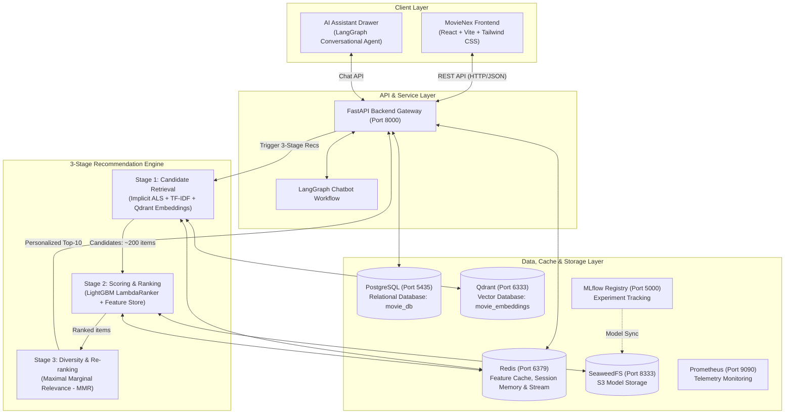
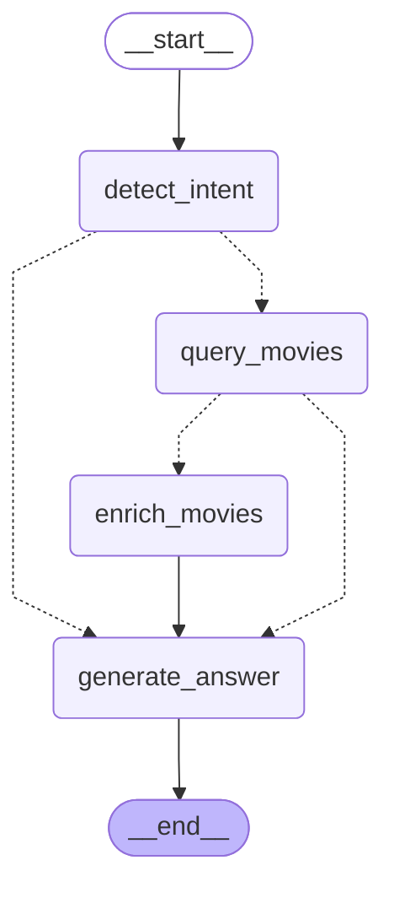

# MovieNex — End-to-End Movie Recommendation Platform

<p align="center">
  <a href="https://www.python.org/"></a>
  <a href="https://fastapi.tiangolo.com/"></a>
  <a href="https://reactjs.org/"></a>
  <a href="https://tailwindcss.com/"></a>
  <a href="https://lightgbm.readthedocs.io/"></a>
  <a href="https://qdrant.tech/"></a>
  <a href="https://www.postgresql.org/"></a>
  <a href="https://redis.io/"></a>
  <a href="https://mlflow.org/"></a>
  <a href="https://www.docker.com/"></a>
</p>

Một nền tảng gợi ý phim hoàn chỉnh đạt chuẩn công nghiệp (Production-Grade) kết hợp kiến trúc **3-Stage Recommendation Engine (Retrieval, Ranking, Re-ranking)**, tìm kiếm tương đồng vector đa chiều với **Qdrant**, giao diện streaming web hiện đại (**MovieNex**) và Trợ lý AI đàm thoại thông minh được xây dựng bằng **LangGraph**.

---

## 📸 Giao diện & Kiến trúc Chatbot AI (Preview)

### 1. Ứng dụng Web MovieNex


### 2. Đồ thị Trạng thái Chatbot AI (LangGraph StateGraph)


---

## ✨ Tính năng Cốt lõi (Key Features)

- **Giao diện Streaming Hiện đại (MovieNex Client)**
  - Giao diện lấy cảm hứng từ Netflix/Prime Video xây dựng bằng **React 18 (Vite)** & **Tailwind CSS**.
  - Các danh mục động: *Trending Now*, *Dành riêng cho bạn (AI 3-Stage)*, *Top Đánh giá*, *Khám phá Thể loại*, và *Danh sách Yêu thích*.
  - Hỗ trợ chuyển đổi Dark / Light mode, modal khảo sát Onboarding giải quyết Cold Start, và ghi nhận sự kiện tương tác thời gian thực.

- **Kiến trúc Gợi ý 3 Lớp Chuẩn Công nghiệp (3-Stage RecSys)**
  - **Stage 1 — Candidate Retrieval (Lọc Thô)**: Kết hợp đa kênh giữa Lọc cộng tác ngầm định (Implicit ALS), Lọc nội dung dựa trên từ khóa (TF-IDF), và Tìm kiếm Vector dày đặc (Dense Vector Search qua **Qdrant**).
  - **Stage 2 — Scoring & Ranking (Xếp Hạng Chi Tiết)**: Mô hình **LightGBM LambdaRanker** & **CatBoost** tối ưu trực tiếp chỉ số NDCG dựa trên 8 đặc trưng kết hợp (User, Item, Cross interactions).
  - **Stage 3 — Re-ranking & Diversity (Đa Dạng Hóa)**: Thuật toán **Maximal Marginal Relevance (MMR)** cân bằng giữa độ chính xác và tính phong phú của thể loại, loại bỏ hiện tượng bong bóng lọc (Filter Bubble).

- **Trợ lý Ảo AI Đàm thoại Thông minh (Conversational Movie Assistant)**
  - Xây dựng trên **LangGraph StateGraph** với 4 node xử lý tuần tự kết hợp rẽ nhánh điều kiện: `detect_intent` $\rightarrow$ `query_movies` $\rightarrow$ `enrich_movies` $\rightarrow$ `generate_answer`.
  - Multi-provider LLM Factory: Ưu tiên **Google Gemini 2.5 Flash**, hỗ trợ fallback sang **OpenRouter**, **ZhipuAI** và bộ phân loại Heuristic ngoại tuyến.
  - Quản lý bộ nhớ hội thoại tự động lưu trong **Redis** với TTL 7 ngày.

- **Pipeline Xử lý Đặc trưng & MLOps Liên tục**
  - **Batch Pipeline** (`pipeline/batch_pipeline.py`): Trích xuất TF-IDF, huấn luyện Implicit ALS, tính ma trận Item-Item cosine similarity, đồng bộ Redis, Qdrant và Feast Feature Store.
  - **Streaming Pipeline** (`pipeline/stream_pipeline.py`): Lắng nghe Redis Stream `user-events-stream`, cập nhật điểm Trending và User Profile thời gian thực.
  - **1-Click Continuous Training (CT)** (`evaluation/train_pipeline.py`): Huấn luyện tự động, kiểm tra Quality Gate, ghi log thí nghiệm lên **MLflow Tracking Server** và lưu artifact lên **SeaweedFS S3**.

---

## 🏗️ Kiến trúc Tổng thể Hệ thống



---

## 🤖 Đồ thị Trạng thái Trợ lý AI (LangGraph StateGraph)



---

## 📁 Cấu trúc Thư mục Dự án

| Thư mục / Tệp tin | Mô tả chi tiết | Tài liệu |
| :--- | :--- | :--- |
| 📂 [`data/`](./data/README.md) | Dữ liệu crawler TMDB (2000-2026), bộ giả lập simulator, nạp PostgreSQL và tập dữ liệu MovieLens 100k | [README](./data/README.md) |
| ├── 📂 [`data/simulator/`](./data/simulator/README.md) | Bộ giả lập tương tác người dùng nâng cao (Time Decay, Gamma distribution, phễu hành vi, OLTP generator) | [README](./data/simulator/README.md) |
| 📂 [`docker/`](./docker/README.md) | Tệp cấu hình hạ tầng cho PostgreSQL, Redis, Qdrant, SeaweedFS S3, MLflow, Prometheus | [README](./docker/README.md) |
| 📂 [`docs/`](./docs/) | Tài liệu kỹ thuật chi tiết về kiến trúc, KPIs kinh doanh, thuật toán RecSys, ML pipeline và DevOps | [Thư mục Docs](./docs/) |
| 📂 [`evaluation/`](./evaluation/README.md) | Trung tâm nghiên cứu & đánh giá toàn diện mô hình học máy và học sâu | [README](./evaluation/README.md) |
| ├── 📂 [`evaluation/machine_learning/`](./evaluation/machine_learning/README.md) | Thực nghiệm ML truyền thống (User/Item CF, SVD, SVD++, NMF, Factorization Machines) | [README](./evaluation/machine_learning/README.md) |
| ├── 📂 [`evaluation/deep_learning/`](./evaluation/deep_learning/README.md) | Thực nghiệm Deep Learning (NCF/NeuMF, AutoRec, Wide & Deep) với checkpoint weights | [README](./evaluation/deep_learning/README.md) |
| ├── 📂 [`evaluation/ml_pipeline/`](./evaluation/ml_pipeline/README.md) | Bộ 6 notebooks liên kết thực thi trọn vẹn pipeline 3 tầng và đánh giá End-to-End | [README](./evaluation/ml_pipeline/README.md) |
| ├── 📂 [`evaluation/ml_training/`](./evaluation/ml_training/README.md) | Huấn luyện mô hình xếp hạng LightGBM và CatBoost kết hợp Optuna hyperparameter tuning | [README](./evaluation/ml_training/README.md) |
| └── 📄 [`evaluation/train_pipeline.py`](./evaluation/train_pipeline.py) | Script 1-Click Continuous Training tự động hóa huấn luyện, đánh giá LOO và ghi log MLflow | — |
| 📂 [`pipeline/`](./pipeline/README.md) | Batch feature pipeline, Streaming consumer (Redis stream), và Feast feature store materialization | [README](./pipeline/README.md) |
| 📂 [`web_app/`](./web_app/README.md) | Ứng dụng Full-stack MovieNex hoàn chỉnh | [README](./web_app/README.md) |
| ├── 📂 [`web_app/backend/`](./web_app/backend/README.md) | FastAPI Gateway (MVC + Services, Qdrant vector search, LangGraph chatbot, Prometheus telemetry) | [README](./web_app/backend/README.md) |
| └── 📂 [`web_app/frontend/`](./web_app/frontend/README.md) | Giao diện streaming React 18 (Vite, Tailwind CSS, Lucide icons, Dark/Light theme, Chatbot drawer) | [README](./web_app/frontend/README.md) |
| 📄 [`docker-compose.yml`](./docker-compose.yml) | Điều phối toàn bộ các dịch vụ hạ tầng, cơ sở dữ liệu và container ứng dụng | — |
| 📄 [`start-webapp.sh`](./start-webapp.sh) | Script khởi động 1-Click tự động cho Linux / macOS | — |
| 📄 [`start-webapp.ps1`](./start-webapp.ps1) | Script khởi động 1-Click tự động cho Windows PowerShell | — |

---

## ⚡ Hướng dẫn Khởi chạy Nhanh (Quick Start)

### 1. Chuẩn bị Mã nguồn & Môi trường

```bash
# Clone repository
git clone https://github.com/dducsw/movie-recsys.git
cd movie-recsys

# Tạo file cấu hình môi trường từ mẫu
cp .env.example .env
```
Chỉnh sửa file `.env` nếu bạn muốn tích hợp LLM Key (Google Gemini, OpenRouter hoặc ZhipuAI) và TMDB API Key.

---

### 2. Khởi chạy WebApp 1-Click (Khuyên Dùng)

#### Cách A: Trên Linux / macOS
```bash
chmod +x start-webapp.sh
./start-webapp.sh
```

#### Cách B: Trên Windows (PowerShell)
```powershell
.\start-webapp.ps1
```
*(Script sẽ tự động khởi động Docker containers, tạo virtualenv backend, cài đặt dependencies npm và khởi chạy song song Backend + Frontend)*.

---

### 3. Khởi chạy Thủ công Từng Thành phần

Nếu bạn muốn kiểm soát chi tiết từng dịch vụ:

#### Bước 3.1: Khởi động Hạ tầng Lưu trữ (Docker Compose)
```bash
docker compose up -d postgres redis qdrant seaweedfs prometheus
```

#### Bước 3.2: Khởi tạo Dữ liệu Phim & Người dùng (Lần đầu chạy)
```bash
# Import dữ liệu phim vào PostgreSQL
python data/simulator/import_movies_to_db.py --csv_path data/crawler/movies_crawled.csv

# Sinh dữ liệu người dùng và lịch sử tương tác OLTP vào PostgreSQL
python data/simulator/generate_oltp_data.py --num_users 100

# Chạy Batch Feature Pipeline để tính similarity và đẩy embeddings lên Qdrant & Redis
python pipeline/batch_pipeline.py
```

#### Bước 3.3: Khởi chạy Backend FastAPI
```bash
cd web_app/backend
pip install -r requirements.txt
python -m uvicorn main:app --host 0.0.0.0 --port 8000 --reload
```
* API Server: http://localhost:8000
* Swagger Docs: http://localhost:8000/docs
* Prometheus Telemetry: http://localhost:8000/metrics

#### Bước 3.4: Khởi chạy Frontend React (Vite)
Mở một terminal mới:
```bash
cd web_app/frontend
npm install
npm run dev
```
* Giao diện người dùng: **http://localhost:5173**

---

### 4. Khởi chạy Toàn bộ trong Docker (Containerized Mode)
Nếu muốn chạy cả Frontend và Backend hoàn toàn bên trong Docker mà không cần cài đặt Node.js hay Python cục bộ:
```bash
docker compose --profile app up -d --build
```

---

### 5. Huấn luyện Mô hình Học máy 1-Click (Continuous Training)
Để tái huấn luyện mô hình xếp hạng LightGBM mới nhất với dữ liệu tương tác hiện tại và ghi log vào MLflow:
```bash
# Đảm bảo MLflow đang chạy
docker compose up -d mlflow postgres seaweedfs

# Thực thi pipeline huấn luyện
python evaluation/train_pipeline.py
```
* Dashboard MLflow: **http://localhost:5000**

---

## 🌐 Danh mục Cổng Truy cập Mặc định

| Dịch vụ | Địa chỉ URL | Cổng | Mô tả |
| :--- | :--- | :--- | :--- |
| **MovieNex Web Client** | [http://localhost:5173](http://localhost:5173) | `5173` | Giao diện streaming người dùng |
| **FastAPI Backend API** | [http://localhost:8000](http://localhost:8000) | `8000` | REST API cho ứng dụng và hệ gợi ý |
| **Swagger UI Documentation** | [http://localhost:8000/docs](http://localhost:8000/docs) | `8000` | Tài liệu API tương tác trực tiếp |
| **Qdrant Vector Dashboard** | [http://localhost:6333/dashboard](http://localhost:6333/dashboard) | `6333` | Quản lý Vector Collections và Search |
| **MLflow Experiment Tracking** | [http://localhost:5000](http://localhost:5000) | `5000` | Quản lý thí nghiệm và Model Registry |
| **Prometheus Telemetry** | [http://localhost:9090](http://localhost:9090) | `9090` | Thu thập metrics độ trễ và lưu lượng |
| **PostgreSQL Database** | `localhost:5435` | `5435` | CSDL quan hệ chính (`movie_db`) |
| **Redis Cache** | `localhost:6379` | `6379` | Online Feature Cache & Streams |
| **SeaweedFS S3 Storage** | [http://localhost:8333](http://localhost:8333) | `8333` | Kho lưu trữ Object tương thích AWS S3 |

---

## 📚 Tài liệu Kỹ thuật Chi tiết (`docs/`)

| Tài liệu | Lĩnh vực | Nội dung cốt lõi |
| :--- | :--- | :--- |
| 📘 [**System Architecture**](./docs/architecture.md) | Kiến trúc Hạ tầng | Quy trình phục vụ $\le 50\text{ms}$ p95, mô hình luồng dữ liệu Hybrid Lambda/Kappa, Redis feature cache, và Qdrant vector engine. |
| 📗 [**Business Requirements & KPIs**](./docs/business-requirements.md) | Nghiệp vụ & Chỉ số | Hành trình người dùng, chỉ số North Star, công thức toán học ($HR@K$, $NDCG@K$, $ILD$), và chiến lược Cold-Start. |
| 📙 [**Applied RecSys & Conversational AI**](./docs/recsys-applied.md) | Thuật toán & Trợ lý AI | Cơ sở toán học của iALS, Factorization Machines, LightGBM vs. CatBoost, MMR diversity, và cỗ máy trạng thái LangGraph. |
| 📕 [**ML Pipeline Specification**](./docs/ml-pipeline.md) | Kỹ thuật ML 3 Lớp | Stage 1 Multi-channel Retrieval, Stage 2 Feature Engineering & Ranking, Stage 3 MMR, và giao thức Time-Based LOO. |
| 📓 [**Production Deployment & MLOps**](./docs/deployment.md) | DevOps & Giám sát | Docker Compose orchestration, MLflow model registry, Quality Gates tự động, zero-downtime hot reload, và phát hiện data drift. |

---

## 👥 Nhóm Tác giả & Đóng góp

| Họ và Tên | Vai trò | Chuyên ngành | Trường Đại học |
| :--- | :--- | :--- | :--- |
| **Lê Đình Đức** | Big Data & RecSys Engineer | Khoa học Máy tính | Đại học Bách Khoa ĐHQG-HCM (HCMUT) |
| **Huỳnh Lê Duy Khánh** | Data Scientist / Co-Developer | Công nghệ Thông tin | Đại học Khoa học Tự nhiên ĐHQG-HCM (HCMUS) |

---

## 📄 Bản quyền (License)

Dự án được phân phối dưới giấy phép **MIT License** — xem tệp [LICENSE](LICENSE) để biết thêm thông tin chi tiết.
