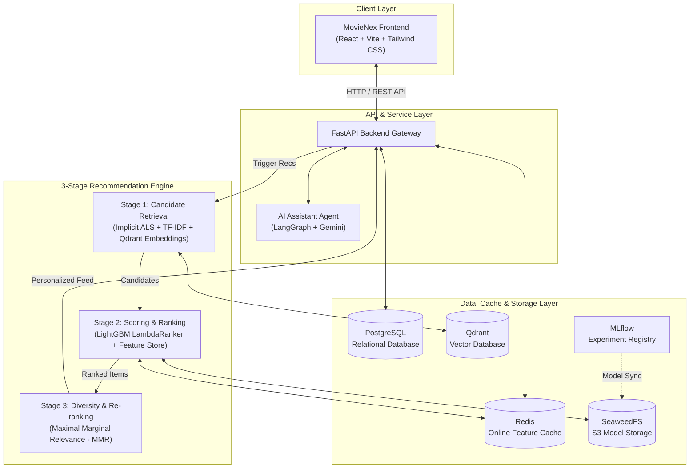

# MovieNex — End-to-End Movie Recommendation System

<p align="center">
  <a href="https://www.python.org/"></a>
  <a href="https://fastapi.tiangolo.com/"></a>
  <a href="https://reactjs.org/"></a>
  <a href="https://tailwindcss.com/"></a>
  <a href="https://lightgbm.readthedocs.io/"></a>
  <a href="https://qdrant.tech/"></a>
  <a href="https://www.postgresql.org/"></a>
  <a href="https://redis.io/"></a>
  <a href="https://mlflow.org/"></a>
  <a href="https://www.docker.com/"></a>
</p>

A production-grade, end-to-end movie recommendation platform combining an industrial **3-Stage Recommendation Pipeline (Retrieval, Ranking, Re-ranking)**, multi-modal search, interactive streaming web interface (**MovieNex**), and conversational AI movie assistant.

---

## 📸 Preview


---

## ✨ Key Features

- **Modern Streaming Web Experience (MovieNex)**
  - Netflix/Modern streaming-inspired responsive interface built with **React (Vite)** & **Tailwind CSS**.
  - Dynamic discovery sections: *Trending Now*, *For You (AI 3-Stage Engine)*, *Top Rated*, *Genre Explorer*, and *Watchlist/Favourites*.
  - Dark / Light mode toggle and real-time interaction feedback (clicks, ratings, likes).

- **Industrial 3-Stage Recommendation Architecture**
  - **Stage 1 — Candidate Retrieval (Candidate Generation)**: Multi-channel candidate retrieval combining Collaborative Filtering (Implicit ALS), Content-Based TF-IDF, and Dense Vector Search via **Qdrant**.
  - **Stage 2 — Scoring & Ranking**: High-precision **LightGBM LambdaRanker** utilizing rich engineered user, item, and user-item interaction features.
  - **Stage 3 — Re-ranking & Diversity**: **Maximal Marginal Relevance (MMR)** balancing relevance and catalog diversity to eliminate filter bubbles.

- **Intelligent Conversational Movie Assistant**
  - Built-in AI Agent leveraging **LangChain**, **LangGraph**, and **Gemini** to provide natural language movie recommendations, plot queries, and personalized guidance.

- **Rigorous Machine Learning Benchmarking (`evaluation/ml*`)**
  - Systematic offline evaluations across classical algorithms (`machine_learning`), end-to-end multi-stage architectures (`ml_pipeline`), and hyperparameter-tuned gradient boosted trees (`ml_training` with LightGBM & CatBoost).

- **Production-Ready Infrastructure & MLOps**
  - **PostgreSQL**: Primary relational data store for movies, user profiles, and interactions.
  - **Redis**: Low-latency cache and online feature store for sub-millisecond retrieval.
  - **Qdrant**: High-performance vector database for semantic similarity and embedding retrieval.
  - **SeaweedFS**: S3-compatible object storage for model artifacts and datasets.
  - **MLflow**: Centralized experiment tracking, metric visualization, and model registry.

---

## 🏗️ System Architecture



---

## 📁 Repository Structure

```
movie-recsys/
├── assest/                         # Project screenshots & visual assets
│   └── image.png
├── docker/                         # Dockerfiles for custom services (e.g. MLflow)
├── docs/                           # Research documents, papers & architecture notes
├── evaluation/                     # Model exploration, benchmarks & ML pipeline
│   ├── eda/                        # Exploratory Data Analysis notebooks
│   ├── machine_learning/           # Classical ML models (SVD, ALS, NMF, CF)
│   ├── deep_learning/              # Neural CF, Autoencoders, Sequential & GNN models
│   ├── ml_pipeline/                # End-to-end 3-Stage recommendation pipeline
│   ├── ml_training/                # Offline training & artifact export scripts
│   └── recsys_utils.py             # Evaluation metrics & utility functions
├── pipeline/                       # Feature pipelines & streaming ingestion
│   ├── feature/                    # Feature store definitions
│   ├── batch_pipeline.py           # Batch processing scripts
│   └── stream_pipeline.py          # Real-time event streaming scripts
├── web_app/                        # Full-stack web application
│   ├── backend/                    # FastAPI service, database models, recommendation APIs
│   └── frontend/                   # React + Vite + Tailwind CSS client
├── docker-compose.yml              # Multi-container orchestration (DB, Cache, Vector DB, MLflow)
├── requirements.txt                # Global Python dependencies
└── start-webapp.ps1                # Automated startup script for Windows PowerShell
```

---

## ⚡ Quick Start

### 1. Clone the Repository
```bash
git clone https://github.com/dducsw/movie-recsys.git
cd movie-recsys
```

### 2. Configure Environment Variables
Copy the template and configure your secrets (e.g. database credentials, TMDB API Key, Gemini API Key):
```bash
cp .env.example .env
```

### 3. Launch Infrastructure (Docker Compose)
Start the core infrastructure services (PostgreSQL, Redis, Qdrant, SeaweedFS, MLflow):
```bash
docker compose up -d
```

### 4. Run the Web Application

#### Option A — Automated Launch (Windows PowerShell)
```powershell
.\start-webapp.ps1
```

#### Option B — Manual Launch

**Backend (FastAPI)**:
```bash
cd web_app/backend
python -m venv venv
# Activate virtualenv (Windows: .\venv\Scripts\activate | Linux/macOS: source venv/bin/activate)
pip install -r requirements.txt
uvicorn main:app --reload --host 0.0.0.0 --port 8000
```

**Frontend (React + Vite)**:
```bash
cd web_app/frontend
npm install
npm run dev
```

The application will be accessible at:
- **Frontend UI**: [http://localhost:5173](http://localhost:5173)
- **Backend API Docs (Swagger UI)**: [http://localhost:8000/docs](http://localhost:8000/docs)
- **MLflow Tracking Dashboard**: [http://localhost:5000](http://localhost:5000)
- **Qdrant Vector Dashboard**: [http://localhost:6333/dashboard](http://localhost:6333/dashboard)

---

## 📚 Documentation & Technical Specifications

Comprehensive engineering specifications, mathematical formulations, and operational guides are available in the [`docs/`](./docs) directory:

| Document | Topic / Area | Key Highlights |
| :--- | :--- | :--- |
| 📘 [**System Architecture**](./docs/architecture.md) | Infrastructure & Serving | End-to-end serving sequence ($\le 50\,\text{ms}$ p95), Hybrid Lambda/Kappa stream-batch flow, Redis feature store, and Qdrant vector engine. |
| 📗 [**Business Requirements & KPIs**](./docs/business-requirements.md) | Product & Metric Framework | User discovery journeys, North Star & conversion metrics, metric formulas ($HR@K$, $NDCG@K$, $ILD$), and cold-start strategies. |
| 📙 [**Applied RecSys & Conversational AI**](./docs/recsys-applied.md) | Algorithms & Agentic Workflows | Mathematical formulations of iALS, FM, LightGBM vs. CatBoost, MMR diversity, and LangGraph conversational state machine. |
| 📕 [**ML Pipeline Specification**](./docs/ml-pipeline.md) | 3-Stage Engineering Deep Dive | Stage 1 Multi-channel Retrieval, Stage 2 Feature Engineering & Ranking, Stage 3 MMR, and Time-Based Leave-One-Out (LOO) protocol. |
| 📓 [**Production Deployment & MLOps**](./docs/deployment.md) | DevOps, CI/CD & Monitoring | Docker Compose service orchestration, MLflow model registry, automated promotion gates, zero-downtime hot reloading, and drift detection. |

---

## 👥 Team Members

| Name | Role / Focus | Department | Institution |
| :--- | :--- | :--- | :--- |
| **Le Dinh Duc** | Big Data Engineer | Computer Science | Ho Chi Minh City University of Technology (HCMUT) |
| **Huynh Le Duy Khanh** | Co-Developer / Data Scientist | Information Technology | Ho Chi Minh City University of Science (HCMUS) |

---

## 📄 License

This project is licensed under the MIT License — see the [LICENSE](LICENSE) file for details.


