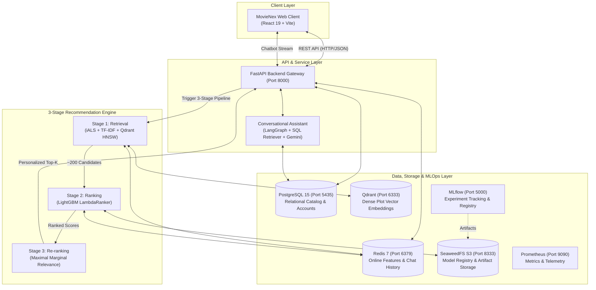

# MovieNex — End-to-End Movie Recommendation Platform

<p align="center">
  <a href="https://www.python.org/"></a>
  <a href="https://fastapi.tiangolo.com/"></a>
  <a href="https://react.dev/"></a>
  <a href="https://lightgbm.readthedocs.io/"></a>
  <a href="https://qdrant.tech/"></a>
  <a href="https://www.postgresql.org/"></a>
  <a href="https://redis.io/"></a>
  <a href="https://mlflow.org/"></a>
  <a href="https://www.docker.com/"></a>
</p>

MovieNex is an industry-grade, end-to-end movie recommendation and discovery platform. It is engineered around an industry-standard **3-Stage Recommendation Architecture** (Multi-Channel Candidate Retrieval $\rightarrow$ Gradient Boosted Decision Tree Ranking $\rightarrow$ Diversity-focused Re-ranking) and enhanced with a conversational **AI Assistant** capable of open-ended film discussions, plot interpretations, and schema-aware PostgreSQL Text-to-SQL querying.

The monorepo encompasses an online serving backend (**FastAPI**), an interactive web client (**React 19 + Vite**), a shared core ML package (`recsys_core`) that completely eliminates training-serving skew, and an automated continuous training (CT) pipeline with **MLflow** experiment tracking and **SeaweedFS** S3 artifact storage.

---

## 📸 Preview


---

## ✨ Key Highlights

- **3-Stage RecSys Engine ($< 50\,\text{ms}$ p95 SLA):**
  - **Stage 1 (Retrieval):** Combines Implicit ALS matrix factorization, TF-IDF content similarity, and dense vector embeddings indexed via **Qdrant HNSW** to generate $200\text{--}250$ high-recall candidates in $< 15\,\text{ms}$.
  - **Stage 2 (Ranking):** Listwise scoring powered by **LightGBM LambdaRank** (`objective="lambdarank"`) across 8 standardized user, item, and cross interaction features in $< 10\,\text{ms}$.
  - **Stage 3 (Re-ranking):** **Maximal Marginal Relevance (MMR)** with dynamic genre-entropy weighting ($\lambda = 0.7$) to eliminate filter bubbles while preserving top accuracy in $< 5\,\text{ms}$.
- **Smart Conversational AI Concierge (LangGraph):**
  - Built with a stateful LangGraph workflow supporting **Multi-Provider LLM orchestration** (Google Gemini 2.5 Flash, OpenRouter, ZhipuAI).
  - **Schema-Aware Text-to-SQL Engine:** Converts natural language queries into safe PostgreSQL SELECT queries (with read-only guardrails, LIMIT clamping, and injection prevention) for querying directors, cast, release dates, ratings, and user watchlists.
  - **Open-Ended Cinema Dialogue:** Responds to cinematic trivia, complex plot analyses, and ending explanations while streaming responsive movie card carousels directly to the frontend.
- **Production-Ready MLOps & Continuous Training (CT):**
  - Time-based Leave-One-Out (LOO) dataset splitting with uniform negative sampling.
  - Strict metric quality gates ($HR@10$, $NDCG@10$, $ILD$, inference latency) before publishing model artifacts to MLflow Registry and SeaweedFS S3.
  - Nearline streaming updates powered by **Redis Streams** for real-time trending and user preference adaptation.

---

## 🏗️ System Architecture



---

## 🧭 System Overview & Component Responsibilities

| Layer / Service | Primary Technologies | Core Responsibilities |
| :--- | :--- | :--- |
| **Web Client** | React 19, Vite, Vanilla CSS | Interactive streaming UI, discovery carousels, responsive chat drawer, onboarding survey. |
| **API Gateway** | FastAPI, Uvicorn, Pydantic v2 | Authentication (JWT), request routing, recommendation orchestration, event ingestion. |
| **Stage 1: Retrieval** | Implicit ALS, TF-IDF, Qdrant | Candidate generation ($200\text{--}250$ items) in $< 15\,\text{ms}$ SLA budget. |
| **Stage 2: Ranking** | LightGBM LambdaRank | Listwise scoring across 8 standardized user, item, and cross features in $< 10\,\text{ms}$. |
| **Stage 3: Re-ranking** | Maximal Marginal Relevance (MMR) | Diversity balancing ($\lambda = 0.7$) to avoid genre clustering in $< 5\,\text{ms}$. |
| **Conversational AI** | LangGraph, Gemini, SQL Retriever | General cinema QA, movie trivia, and read-only PostgreSQL Text-to-SQL querying. |
| **Databases & Cache** | PostgreSQL 15, Redis 7, Qdrant | Catalog persistence, relational interactions, sub-millisecond feature lookup, vector search. |
| **Storage & Tracking** | SeaweedFS (S3), MLflow 2.15 | S3-compatible model binary storage, experiment tracking, and model lifecycle management. |
| **Core Library** | `libs/recsys_core` | Shared feature extractors, ranking metrics ($HR$, $NDCG$, $ILD$), and re-ranking algorithms. |

---

## 🚀 How to Run the Project

### 1. Prerequisites
Make sure the following tools are installed on your workstation:
- **Docker & Docker Compose** (tested on Docker Engine 24+ or Docker Desktop with WSL 2)
- **Python 3.10+** (tested on Python 3.12 / 3.13)
- **Node.js 18+** and **npm**

---

### 2. Environment Configuration (`.env`)
The project reads all configuration secrets and connection strings from a single `.env` file located at the **repository root**:

```bash
# Copy template from root
cp .env.example .env
```

Open `.env` and configure your API keys and service credentials:
```ini
# --- AI Assistant (Chatbot) ---
GOOGLE_API_KEY="your-gemini-api-key"        # Recommended: Gemini 2.5 Flash
OPENROUTER_API_KEY="your-openrouter-key"    # Optional fallback
TMDB_API_KEY="your-tmdb-api-key"            # For metadata crawling & posters

# --- Relational Database (PostgreSQL) ---
POSTGRES_USER=postgres
POSTGRES_PASSWORD=mysecretpassword
POSTGRES_DB=movie_db
DB_HOST=127.0.0.1
DB_PORT=5435

# --- Cache & Feature Store (Redis) ---
REDIS_HOST=127.0.0.1
REDIS_PORT=6379

# --- Vector Database (Qdrant) ---
QDRANT_HOST=127.0.0.1
QDRANT_PORT=6333
```

---

### 3. Launch Core Infrastructure (Docker)
Start PostgreSQL, Redis, Qdrant, SeaweedFS, MLflow, and Prometheus in detached mode:

```bash
make infra
# or directly with docker compose:
docker compose up -d
```

To verify that all containers are healthy:
```bash
docker compose ps
```

---

### 4. Database Initialization *(First-time setup only)*
If running on a fresh PostgreSQL database instance, load the curated movie dataset (~10,000 titles):

```bash
# Populate normalized relational tables (movies, directors, actors, genres, tags)
python data/simulator/import_movies_to_db.py --csv_path data/crawler/movies_crawled.csv

# (Optional) Generate realistic synthetic users and interaction history
python data/simulator/generate_oltp_data.py --num_users 100
```

---

### 5. Launch the Applications

You can launch both Backend and Frontend using either the **1-Click Script** or **Manual Terminals**:

#### Option A: 1-Click Startup *(Recommended)*
- **On Linux / macOS:**
  ```bash
  chmod +x start-webapp.sh
  ./start-webapp.sh
  ```
- **On Windows (PowerShell):**
  ```powershell
  .\start-webapp.ps1
  ```
*(Press `Ctrl + C` in the terminal to terminate all processes simultaneously).*

#### Option B: Manual Step-by-Step Launch
If you prefer running components in separate terminals for independent debugging:

**Terminal 1 — Backend FastAPI Server:**
```bash
cd apps/api
# Install requirements if not already done: pip install -r requirements.txt
uvicorn main:app --host 0.0.0.0 --port 8000 --reload
```
- API Base URL: `http://localhost:8000`
- Interactive Swagger API Documentation: `http://localhost:8000/docs`

**Terminal 2 — Frontend React Client:**
```bash
cd apps/web
npm install   # Run once to install dependencies
npm run dev
```
- Web Application: `http://localhost:5173`

---

### 6. Run Continuous Training (CT Pipeline)
To execute the automated continuous training pipeline (offline data extraction, negative sampling, LightGBM LambdaRank training, quality gate evaluation, and MLflow logging):

```bash
make train
# or: PYTHONPATH=apps/api:libs/recsys_core/src:pipelines/training python pipelines/training/train_pipeline.py
```

---

### 7. Run Automated Tests & Validation
Run the multi-layer test suite covering core math algorithms, training pipelines, API endpoints, and chatbot SQL retrieval:

```bash
make test
```

---

## 🌐 Default Ports & Access Points

| Service | Local URL | Port | Description |
| :--- | :--- | :--- | :--- |
| **MovieNex Web Client** | [http://localhost:5173](http://localhost:5173) | `5173` | React 19 streaming web app & AI Chatbot drawer |
| **FastAPI Backend API** | [http://localhost:8000](http://localhost:8000) | `8000` | Online recommendation & chat serving gateway |
| **Interactive Swagger Docs** | [http://localhost:8000/docs](http://localhost:8000/docs) | `8000` | OpenAPI schema & endpoint playground |
| **Qdrant Vector Dashboard** | [http://localhost:6333/dashboard](http://localhost:6333/dashboard) | `6333` | Vector collection inspection and HNSW status |
| **MLflow Tracking Server** | [http://localhost:5000](http://localhost:5000) | `5000` | Experiment runs, metric charts, and model registry |
| **SeaweedFS S3 API** | [http://localhost:8333](http://localhost:8333) | `8333` | S3 object store for serialized model binaries |
| **Prometheus Telemetry** | [http://localhost:9090](http://localhost:9090) | `9090` | API latency and system metrics scraper |
| **PostgreSQL Database** | `localhost:5435` | `5435` | Primary relational database (`movie_db`) |
| **Redis In-Memory Store** | `localhost:6379` | `6379` | Feature cache, session memory, and stream queues |

---

## 📁 Repository Structure

```
movie-recsys/
├── apps/
│   ├── api/                        # FastAPI serving gateway (MVC architecture, recs, chatbot, SQL retriever)
│   │   ├── app/                    # Controllers, models, services, views, and chatbot agents
│   │   ├── tests/                  # Integration tests and route contracts
│   │   └── main.py                 # FastAPI application entrypoint with lifespan DB init
│   └── web/                        # React 19 + Vite streaming client (Netflix-inspired theme)
│       ├── src/                    # Components, pages, hooks, api clients, and styles
│       └── package.json            # Web client dependencies and build scripts
├── libs/
│   └── recsys_core/                # Monorepo shared core library (eliminates training-serving skew)
│       ├── src/recsys_core/        # Feature transformers, ranking metrics (HR, NDCG, ILD), MMR, RRF
│       └── tests/                  # Unit tests for core algorithms and mathematical validation
├── pipelines/
│   ├── training/                   # 1-Click Continuous Training (CT) pipeline with MLflow logging
│   ├── feature_store/              # Feast feature definitions and Redis materialization
│   ├── batch/                      # Offline batch data pipelines and artifact synchronization
│   └── stream/                     # Nearline Redis stream processing for real-time interactions
├── data/
│   ├── crawler/                    # TMDB metadata crawler scripts and raw datasets
│   └── simulator/                  # Advanced OLTP user interaction simulator & database loaders
├── notebooks/
│   ├── 01_eda/                     # Exploratory Data Analysis
│   ├── 02_classical_ml/            # Classical benchmarks (User/Item CF, SVD, SVD++, NMF, iALS)
│   ├── 03_deep_learning/           # Neural CF, Autoencoders, and sequential models
│   └── 04_pipeline_prototypes/     # 3-stage prototyping and comparison experiments
├── docs/                           # Architectural Decision Records (ADRs) and technical guides
├── assets/                         # Architecture diagrams and UI screenshots
├── start-webapp.sh                 # 1-Click automated launch script for Linux / macOS
├── start-webapp.ps1                # 1-Click automated launch script for Windows
├── Makefile                        # Common developer targets (test, train, infra, lint)
├── docker-compose.yml              # Local infrastructure container orchestration
└── requirements.txt                # Python dependencies root pointer
```

---

## 🧪 Testing & Quality Assurance

The project enforces comprehensive test automation across all layers:

| Test Scope | Target Path | Coverage Focus |
| :--- | :--- | :--- |
| **Core Algorithms** | `libs/recsys_core/tests/` | Feature extraction, ranking metrics ($HR@K$, $NDCG@K$, $ILD$), MMR diversity, RRF fusion. |
| **Training Pipeline** | `pipelines/training/tests/` | Latent factor generation, LightGBM schema compatibility, quality gate evaluation. |
| **API Endpoints** | `apps/api/tests/test_api.py` | JWT auth lifecycle, candidate scoring SLA ($< 80\,\text{ms}$), cold-start fallback. |
| **SQL Retriever & Chat** | `apps/api/tests/test_sql_retriever.py` | SQL injection prevention, safe SELECT validation, heuristic parser, LLM intent routing. |

Run the full automated test suite:
```bash
make test
```

---

## 📚 Technical Documentation

In-depth technical guides, design rationales, and metric formulations are located in the [`docs/`](./docs) directory:

- 📘 [**System Architecture**](./docs/architecture.md) — Service boundaries, data flow, latency budgets ($\le 50\,\text{ms}$), and caching strategy.
- 📗 [**ML Pipeline Specification**](./docs/ml-pipeline.md) — Multi-channel retrieval, feature engineering, LightGBM training, and LOO evaluation.
- 📙 [**Applied RecSys & AI**](./docs/recsys-applied.md) — Mathematical formulation of iALS, LightGBM LambdaRank, MMR, and LangGraph agent workflow.
- 📓 [**Production Deployment & MLOps**](./docs/deployment.md) — Container orchestration, zero-downtime hot reloading, and MLflow model registry lifecycle.
- 📕 [**Business Requirements**](./docs/business-requirements.md) — User personas, North Star metrics, and offline-to-online metric alignment.
- 📔 [**Architecture Decisions (ADRs)**](./docs/architecture-decisions.md) — Rationale for monorepo layout, shared core library, and skew control.

---

## 👥 Contributors & Team

| Contributor | Focus Area | Affiliation |
| :--- | :--- | :--- |
| **Le Dinh Duc** | Big Data & RecSys Engineer | Computer Science, Ho Chi Minh City University of Technology (HCMUT) |
| **Huynh Le Duy Khanh** | Data Scientist / Machine Learning Engineer | Information Technology, Ho Chi Minh City University of Science (HCMUS) |

---

## 📄 License

This project is licensed under the MIT License — see the [LICENSE](LICENSE) file for details.
