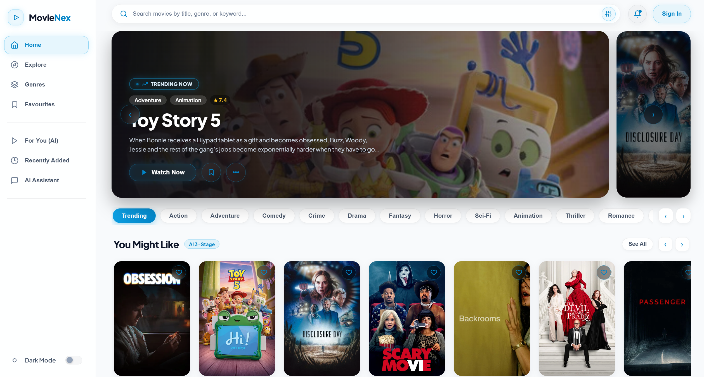
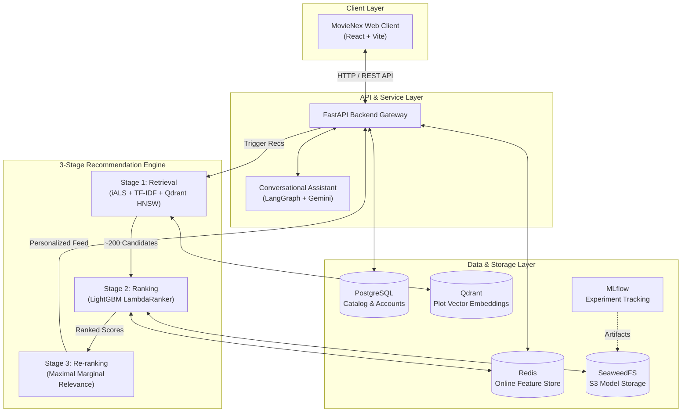

# MovieNex — End-to-End Movie Recommendation System

<p align="center">
  <a href="https://www.python.org/"></a>
  <a href="https://fastapi.tiangolo.com/"></a>
  <a href="https://react.dev/"></a>
  <a href="https://lightgbm.readthedocs.io/"></a>
  <a href="https://qdrant.tech/"></a>
  <a href="https://www.postgresql.org/"></a>
  <a href="https://redis.io/"></a>
  <a href="https://mlflow.org/"></a>
  <a href="https://www.docker.com/"></a>
</p>

MovieNex is an end-to-end movie recommendation platform designed around a standard 3-stage recommendation architecture: multi-channel candidate retrieval, gradient boosted decision tree ranking, and diversity-focused re-ranking. 

The project includes an online inference backend (FastAPI), a responsive web client (React), a shared core package (`recsys_core`) that prevents training-serving skew, and an automated continuous training (CT) pipeline with MLflow tracking.

---

## 📸 Preview



---

## 🧭 System Overview

The application satisfies real-time serving latency constraints ($\le 50\,\text{ms}$) while supporting offline continuous training:

| Layer | Primary Tech | Responsibility |
| :--- | :--- | :--- |
| **Web Client** | React 18, Vite, Tailwind CSS | User interface, personalized discovery shelves, user preference collection. |
| **API Gateway** | FastAPI, Uvicorn, Pydantic v2 | Request routing, auth, telemetry ingestion, recommendation orchestration. |
| **Stage 1: Retrieval** | Implicit ALS, TF-IDF, Qdrant | High-recall candidate generation ($200\text{--}250$ items) under $15\,\text{ms}$. |
| **Stage 2: Ranking** | LightGBM (LambdaRank) | Listwise scoring across 8 standardized user, item, and cross features. |
| **Stage 3: Re-ranking** | Maximal Marginal Relevance (MMR) | Diversity optimization ($\lambda = 0.7$) to avoid genre-clustering filter bubbles. |
| **Data & Cache** | PostgreSQL 15, Redis 7 | User catalog, relational interactions, sub-millisecond feature lookup. |
| **Storage & Tracking** | SeaweedFS (S3), MLflow | Object storage for model binaries, metrics logging, and model registry. |
| **Core Package** | `libs/recsys_core` | Shared feature extractors, ranking metrics, and re-ranking algorithms. |

---

## 🏗️ Architecture



---

## 🎯 3-Stage Recommendation Pipeline

| Stage | Method / Algorithm | Key Inputs | SLA Budget | Output |
| :--- | :--- | :--- | :--- | :--- |
| **1. Candidate Retrieval** | • Implicit ALS (latent factors)<br/>• TF-IDF Cosine Similarity<br/>• Dense Vector Search (Qdrant) | User history, movie genre metadata, plot synopsis embeddings | $< 15\,\text{ms}$ | ~200 candidate IDs |
| **2. Feature Ranking** | LightGBM LambdaRanker (`objective="lambdarank"`) | 8 standardized features:<br/>`popularity`, `vote_average`, `genre_overlap`, `release_year`, `user_activity`, `user_bias`, `als_score`, `cb_score` | $< 10\,\text{ms}$ | Scored & sorted candidates |
| **3. Diversity Re-ranking** | Maximal Marginal Relevance (MMR) | Stage 2 scores, genre vectors, trade-off parameter $\lambda = 0.7$ | $< 5\,\text{ms}$ | Final top-10 recommendation list |

---

## 📁 Repository Structure

```
movie-recsys/
├── apps/
│   ├── api/                        # FastAPI serving gateway (auth, recs, chatbot)
│   └── web/                        # React + Vite streaming user interface
├── libs/
│   └── recsys_core/                # Shared core library (features, metrics, MMR, fusion)
├── pipelines/
│   ├── training/                   # Continuous training pipeline, configs, integration tests
│   ├── feature_store/              # Feast feature definitions and materialization
│   ├── batch/                      # Offline batch pipelines and artifact synchronization
│   └── stream/                     # Nearline Redis stream processing
├── notebooks/
│   ├── 01_eda/                     # Exploratory Data Analysis
│   ├── 02_classical_ml/            # Classical benchmarks (SVD, ALS, NMF)
│   ├── 03_deep_learning/           # Neural CF, Autoencoders, Sequential models
│   └── 04_pipeline_prototypes/     # 3-stage prototyping and comparison experiments
├── docs/                           # Technical documentation and ADRs
├── assets/                         # Architecture diagrams and UI screenshots
├── Makefile                        # Common developer commands
└── docker-compose.yml              # Local infrastructure orchestration
```

---

## ⚡ Quick Start

### 1. Prerequisites
- Docker & Docker Compose
- Python 3.10+ (tested on Python 3.12)
- Node.js 18+ and npm

### 2. Environment Configuration
```bash
cp .env.example .env
```

### 3. Launch Core Infrastructure
```bash
# Start PostgreSQL, Redis, Qdrant, SeaweedFS, and MLflow
make infra
# or: docker compose up -d
```

### 4. Run Tests & Validation
```bash
# Run test suite across apps, core library, and training pipeline
make test
```

### 5. Run Continuous Training
```bash
# Execute the automated 1-click training and evaluation pipeline
make train
```

### 6. Start Applications

| Component | Directory | Commands | Default Port |
| :--- | :--- | :--- | :--- |
| **Backend API** | `apps/api` | `pip install -r requirements.txt`<br/>`uvicorn main:app --reload --port 8000` | [http://localhost:8000/docs](http://localhost:8000/docs) |
| **Frontend UI** | `apps/web` | `npm install`<br/>`npm run dev` | [http://localhost:5173](http://localhost:5173) |
| **MLflow UI** | Orchestrated | `make infra` | [http://localhost:5000](http://localhost:5000) |
| **Qdrant Dashboard** | Orchestrated | `make infra` | [http://localhost:6333/dashboard](http://localhost:6333/dashboard) |

*(On Windows, you can also run `.\start-webapp.ps1` for automated local setup).*

---

## 🧪 Testing & Code Quality

The project maintains a test suite covering unit logic, integration flows, and API contracts:

| Test Scope | Target Path | Coverage Focus |
| :--- | :--- | :--- |
| **Core Algorithms** | `libs/recsys_core/tests/` | Feature extraction, ranking metrics ($HR$, $NDCG$, $ILD$), MMR re-ranking, RRF fusion. |
| **Training Pipeline** | `pipelines/training/tests/` | Retrieval factor generation, LightGBM schema compatibility, quality gate evaluation. |
| **API Endpoints** | `apps/api/tests/` | Route authentication, recommendation serving contracts, cold-start handling. |

To run the complete suite:
```bash
make test
```

---

## 📚 Technical Documentation

Detailed architectural and engineering guides are available in the [`docs/`](./docs) directory:

| Document | Topic | Description |
| :--- | :--- | :--- |
| 📘 [**System Architecture**](./docs/architecture.md) | Architecture & Serving | Service boundaries, latency budgets ($\le 50\,\text{ms}$), data flow, and caching strategy. |
| 📗 [**ML Pipeline Specification**](./docs/ml-pipeline.md) | 3-Stage Pipeline | Retrieval setup, feature engineering, LightGBM training, and LOO validation. |
| 📙 [**Applied RecSys & AI**](./docs/recsys-applied.md) | Algorithms & Math | Formulation of iALS, FM, LightGBM LambdaRank, MMR, and conversational agent. |
| 📓 [**Production & MLOps**](./docs/deployment.md) | Deployment & Ops | Container configuration, runbooks, healthchecks, and model registry lifecycle. |
| 📕 [**Business Requirements**](./docs/business-requirements.md) | Product & Metrics | User personas, journey maps, North Star metrics, and offline-to-online metric alignment. |
| 📔 [**Architecture Decisions**](./docs/architecture-decisions.md) | ADR Records | Rationale for monorepo layout, shared core library, and training-serving skew control. |

---

## 👥 Team & Engineering Scope

| Contributor | Focus Area | Affiliation |
| :--- | :--- | :--- |
| **Le Dinh Duc** | Big Data Engineer | Computer Science, Ho Chi Minh City University of Technology (HCMUT) |
| **Huynh Le Duy Khanh** | Data Scientist | Information Technology, Ho Chi Minh City University of Science (HCMUS) |

### 🎯 Key Engineering Contributions (Junior MLE Scope)

| Component | Area | Implementation Details |
| :--- | :--- | :--- |
| **`libs/recsys_core`** | Shared Core Package | Packaged reusable feature transformations, ranking metrics ($HR@K$, $NDCG@K$, $ILD$), and re-ranking algorithms (RRF, MMR) to eliminate training-serving skew. |
| **`pipelines/training`** | Continuous Training (CT) | Implemented 1-click training pipeline with Time-Based Leave-One-Out split, negative sampling, LightGBM LambdaRank training from YAML configs, and MLflow logging. |
| **Metric Quality Gates** | MLOps & Validation | Automated latency ($< 30\,\text{ms}$) and metric quality gates preventing regression before model artifact publishing. |
| **Serving Integration** | FastAPI Serving Gateway | Harmonized feature schemas across offline training and live serving in `apps/api/app/services/recsys.py`. |
| **Testing Infrastructure** | CI / Automation | Authored multi-layer automated test suite (46 tests) integrated into GitHub Actions CI. |

---

## 📄 License

This project is licensed under the MIT License — see the [LICENSE](LICENSE) file for details.
