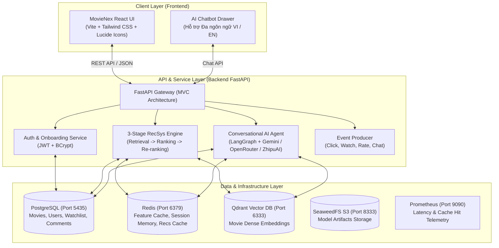
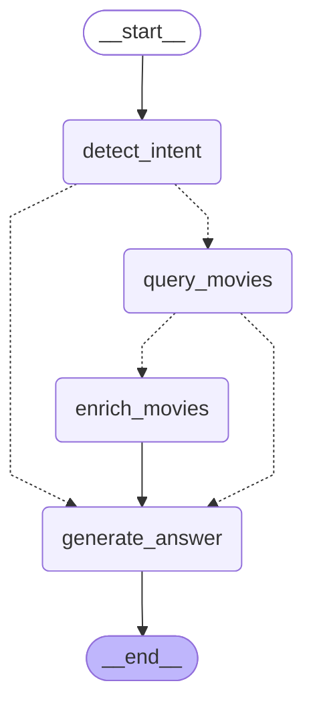

# 🍿 MovieNex Web Application (React + FastAPI + RecSys + AI Chatbot)

Tài liệu này cung cấp hướng dẫn toàn diện về ứng dụng web **MovieNex** — nền tảng streaming phim thông minh tích hợp bộ máy gợi ý 3 Lớp công nghiệp và Trợ lý ảo AI đàm thoại tự nhiên (**LangGraph Chatbot**).

---

## 📸 Giao diện Ứng dụng (MovieNex Preview)


---

## 🏛️ Kiến trúc Hệ thống (System Architecture)



---

## 🤖 Kiến trúc Chatbot AI (LangGraph Conversational Agent)

Hệ thống tích hợp một trợ lý AI thông minh được xây dựng bằng **LangGraph StateGraph**, hỗ trợ gợi ý phim theo ngữ cảnh tự nhiên, lọc thể loại, phân tích cốt truyện và đề xuất phim tương tự:

### Sơ đồ Luồng Trạng thái (LangGraph StateGraph):



### Graph Image Export:


### Các Node và Logic Xử lý:
1. **`detect_intent`**: Phân loại ý định người dùng (tìm phim theo thể loại, tìm phim tương tự, hỏi đáp chung, chào hỏi), tự động nhận diện ngôn ngữ (**Tiếng Việt** / **English**). Hỗ trợ Heuristic Fallback khi không có kết nối LLM ngoài.
2. **`query_movies`**: Truy vấn ứng viên phim tiềm năng từ cơ sở dữ liệu PostgreSQL và Qdrant Vector Database dựa trên thể loại, đạo diễn, từ khóa tìm kiếm hoặc lịch sử yêu thích của user.
3. **`enrich_movies`**: Bổ sung siêu dữ liệu chi tiết cho danh sách phim ứng viên (điểm đánh giá, poster URL, đạo diễn, diễn viên, tóm tắt tóm lược).
4. **`generate_answer`**: Bộ sinh câu trả lời bằng LLM (ưu tiên **Google Gemini 2.5 Flash**, fallback qua **OpenRouter** hoặc **ZhipuAI**), tổng hợp câu trả lời tự nhiên kèm danh sách thẻ phim tương tác trực quan.
5. **Quản lý Bộ nhớ Hội thoại (`ConversationMemory`)**: Lưu lịch sử chat trong **Redis** (`chat:{session_id}:history`) với thời hạn 7 ngày, cho phép tiếp tục mạch đàm thoại liền mạch.

---

## 🗂️ Cấu trúc Thư mục

```
web_app/
├── README.md               # Tài liệu này
├── backend/                # Dịch vụ Backend FastAPI
│   ├── README.md           # Hướng dẫn chi tiết API backend, controllers & services
│   ├── main.py             # FastAPI entrypoint, middleware, CORS & Prometheus metrics
│   ├── requirements.txt    # Danh sách thư viện Python
│   ├── Dockerfile          # Dockerfile đóng gói backend
│   ├── tests/              # Kiểm thử tự động API (test_api.py)
│   └── app/
│       ├── config/         # Cấu hình Database pool (PostgreSQL)
│       ├── models/         # ORM / DAO models (Movie, User, Comment)
│       ├── views/          # Pydantic schemas (Request/Response validation)
│       ├── controllers/    # API endpoints (Auth, Movies, RecSys, Chatbot, Events, Comments)
│       ├── services/       # Business logic (3-Stage RecSys, Chatbot, Cache, Feature Store)
│       └── chatbot/        # LangGraph workflow, nodes, prompts, state
└── frontend/               # Ứng dụng Client React (Vite)
    ├── README.md           # Hướng dẫn chi tiết giao diện, components & cấu hình Vite
    ├── package.json        # Dependencies (React, Lucide, Tailwind, ...)
    ├── vite.config.js      # Cấu hình Vite dev server & proxy
    ├── index.html          # HTML template
    ├── Dockerfile          # Multi-stage Docker build với Nginx
    └── src/
        ├── api/            # API client Axios giao tiếp với backend
        ├── components/     # UI Components (Navbar, MovieCard, ChatbotDrawer, Hero, ...)
        ├── context/        # React Context (AuthContext, ThemeContext, WatchlistContext)
        ├── hooks/          # Custom hooks
        └── pages/          # Các trang (Home, MovieDetail, Favorites, Onboarding)
```

---

## 🚀 Hướng dẫn Khởi chạy WebApp Chi tiết

### Cách 1: Khởi chạy Tự động 1-Click (Khuyên Dùng)

#### Trên Linux / macOS:
```bash
# Cấp quyền thực thi và khởi chạy script
chmod +x start-webapp.sh
./start-webapp.sh
```

#### Trên Windows (PowerShell):
```powershell
# Chạy script PowerShell khởi động Docker infra + Backend + Frontend
.\start-webapp.ps1
```
*(Để tắt toàn bộ: nhấn `Ctrl + C` hoặc chạy `.\start-webapp.ps1 -Down`)*

---

### Cách 2: Khởi chạy Thủ công Từng Dịch vụ

#### Bước 1: Khởi động Hạ tầng Docker (PostgreSQL, Redis, Qdrant)
Từ thư mục gốc dự án (`movie-recsys/`):
```bash
docker compose up -d postgres redis qdrant seaweedfs prometheus
```
Kiểm tra trạng thái container:
```bash
docker compose ps
```

#### Bước 2: Nạp dữ liệu phim vào Database (Lần đầu khởi tạo)
```bash
python data/simulator/import_movies_to_db.py --csv_path data/crawler/movies_crawled.csv
python data/simulator/generate_oltp_data.py --num_users 100
```

#### Bước 3: Khởi chạy Backend FastAPI
```bash
cd web_app/backend

# Kích hoạt virtualenv (hoặc dùng conda activate ml-env)
python -m venv venv
source venv/bin/activate  # Trên Windows: .\venv\Scripts\activate

pip install -r requirements.txt

# Khởi chạy server FastAPI
uvicorn main:app --host 0.0.0.0 --port 8000 --reload
```
* Backend API: http://localhost:8000
* Swagger UI Docs: http://localhost:8000/docs
* Prometheus Metrics: http://localhost:8000/metrics

#### Bước 4: Khởi chạy Frontend React
Mở một terminal mới:
```bash
cd web_app/frontend

npm install
npm run dev
```
* Frontend UI: http://localhost:5173

---

### Cách 3: Chạy Toàn bộ bằng Docker Compose
Nếu muốn đóng gói toàn bộ cả Backend và Frontend chạy trong container:
```bash
docker compose --profile app up -d --build
```

---

## 🌐 Danh sách Cổng Dịch vụ Mặc định

| Dịch vụ | Cổng Host | Đường dẫn Web | Mô tả |
| :--- | :--- | :--- | :--- |
| **MovieNex Frontend** | `5173` | http://localhost:5173 | Giao diện streaming người dùng |
| **FastAPI Backend** | `8000` | http://localhost:8000 | REST API phục vụ WebApp |
| **API Docs (Swagger)** | `8000` | http://localhost:8000/docs | Tài liệu & Test API trực tiếp |
| **Qdrant Vector Dashboard** | `6333` | http://localhost:6333/dashboard | Quản lý Vector Collections |
| **PostgreSQL Database** | `5435` | `localhost:5435` (DB: `movie_db`) | Cơ sở dữ liệu quan hệ chính |
| **Redis Cache** | `6379` | `localhost:6379` | Bộ nhớ đệm & Feature Cache |
| **Prometheus Telemetry** | `9090` | http://localhost:9090 | Thu thập số liệu hiệu năng hệ thống |
| **SeaweedFS S3 Storage** | `8333` | http://localhost:8333 | Kho lưu trữ Object S3 cho model |
