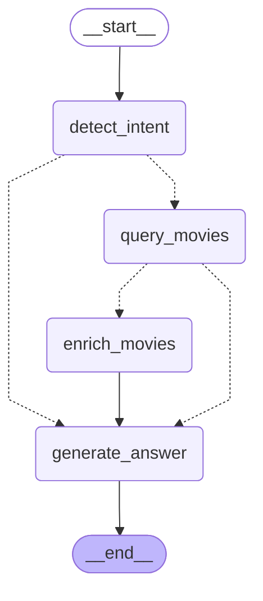
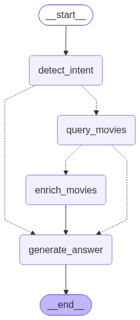

# ⚙️ MovieNex Backend (FastAPI + RecSys Engine + LangGraph Chatbot)

Backend của hệ thống **MovieNex** được xây dựng bằng **FastAPI** theo mô hình kiến trúc MVC kết hợp Services Layer, phục vụ toàn bộ các nhu cầu từ quản lý danh mục phim, xác thực người dùng, theo dõi sự kiện tương tác, cung cấp gợi ý 3 Lớp với độ trễ thấp, và điều phối Trợ lý ảo AI đàm thoại tự nhiên (**LangGraph**).

---

## 🗂️ Cấu trúc Thư mục

```
web_app/backend/
├── main.py                     # Khởi tạo FastAPI app, cấu hình CORS, routers & Prometheus
├── requirements.txt            # Danh sách thư viện Python
├── Dockerfile                  # Đóng gói container Docker cho Backend
├── tests/
│   └── test_api.py             # Bộ kiểm thử tự động API với TestClient
└── app/
    ├── config/
    │   └── db.py               # Quản lý ThreadedConnectionPool kết nối PostgreSQL
    ├── models/                 # Lớp tương tác CSDL trực tiếp (DAO/ORM)
    │   ├── movie.py            # Truy vấn danh sách phim, chi tiết, top rated, trending
    │   ├── user.py             # Quản lý người dùng, sở thích onboarding, watchlist
    │   └── comment.py          # Quản lý bình luận và đánh giá của phim
    ├── views/
    │   └── schemas.py          # Định nghĩa Pydantic Schemas cho Request/Response validation
    ├── controllers/            # API Endpoints điều hướng
    │   ├── auth.py             # Đăng ký, Đăng nhập, JWT Token, Me profile
    │   ├── movie.py            # Lấy danh sách phim, phân trang, lọc thể loại, tìm kiếm
    │   ├── recsys.py           # API gợi ý 3 Lớp (For You, Similar Movies, Trending)
    │   ├── chatbot.py          # API Chat đàm thoại, lịch sử tin nhắn, xóa phiên
    │   ├── events.py           # Ghi nhận sự kiện hành vi (click, detail, watch, rate)
    │   ├── onboarding.py       # Khảo sát sở thích ban đầu cho người dùng mới
    │   └── comment.py          # Thêm, sửa, xóa bình luận & đánh giá sao
    ├── services/               # Lớp Nghiệp vụ (Business Logic)
    │   ├── recsys.py           # Bộ máy gợi ý 3-Stage (Retrieval -> Ranking -> MMR)
    │   ├── chatbot.py          # Quản lý phiên đàm thoại & bộ nhớ Redis (ConversationMemory)
    │   ├── cache.py            # Bộ nhớ đệm InMemory & TTL Cache
    │   ├── feature_store.py    # Tích hợp Redis Online Feature Store & Feast
    │   ├── auth_service.py     # Xử lý băm mật khẩu (BCrypt) & ký/giải mã JWT
    │   ├── event_producer.py   # Phát sự kiện sang Redis Stream ('user-events-stream')
    │   ├── ml_training_service.py # Hỗ trợ gọi suy luận mô hình ML offline
    │   └── metrics.py          # Đo lường Prometheus Histograms & Counters
    └── chatbot/                # Module Trợ lý AI LangGraph
        ├── workflow.py         # Xây dựng StateGraph và liên kết các Nodes
        ├── state.py            # Cấu trúc GraphState và IntentOutput TypedDict
        ├── route.py            # Điều kiện rẽ nhánh (Conditional Edges)
        ├── prompts.py          # System prompts cho phân loại Intent & sinh câu trả lời
        └── agents/             # Các Node xử lý
            ├── detect_intent.py   # Nhận diện ý định, thực thể & phát hiện ngôn ngữ
            ├── query_movies.py    # Truy vấn ứng viên phim từ DB & Qdrant Vector
            ├── enrich_movies.py   # Bổ sung thông tin chi tiết phim
            ├── generate_answer.py # Sinh câu trả lời đàm thoại bằng LLM
            └── __init__.py        # LLM Multi-Provider Factory (Gemini, OpenRouter, ZhipuAI)
```

---

## 🤖 Kiến trúc Chatbot AI (LangGraph StateGraph)

Chatbot được cài đặt dưới dạng một đồ thị trạng thái tuần tự kết hợp rẽ nhánh điều kiện:



### Biểu đồ xuất trực quan:


### Cơ chế Multi-Provider LLM:
File `app/chatbot/agents/__init__.py` tích hợp sẵn cơ chế ưu tiên tự động:
1. **Google Gemini** (`GOOGLE_API_KEY` hoặc `GEMINI_API_KEY`): Model mặc định `gemini-2.5-flash` — tốc độ siêu tốc, hỗ trợ Tiếng Việt & Tiếng Anh chuẩn xác.
2. **OpenRouter** (`OPENROUTER_API_KEY`): Fallback sang các mô hình mã nguồn mở như Llama 3.3, Claude hoặc Gemini qua OpenRouter gateway.
3. **ZhipuAI** (`ZHIPUAI_API_KEY` / `ZHIPUAI_MODEL="glm-4.7-flash"`): Hỗ trợ qua endpoint Zhipu.
4. **Heuristic Fallback Agent**: Khi không có bất kỳ API key nào, hệ thống tự động sử dụng bộ phân loại Regex / Heuristic + Template Engine để trả lời trơn tru mà không làm sập ứng dụng.

---

## 📡 Danh mục API Endpoints Chính

### 1. Xác thực & Người dùng (`/api/auth`)
* `POST /api/auth/register`: Đăng ký tài khoản mới.
* `POST /api/auth/login`: Đăng nhập lấy Bearer JWT Token.
* `GET /api/auth/me`: Lấy thông tin tài khoản hiện tại.
* `POST /api/auth/watchlist`: Thêm phim vào danh sách xem sau.
* `GET /api/auth/watchlist`: Lấy danh sách phim đã lưu.

### 2. Danh mục Phim (`/api/movies`)
* `GET /api/movies`: Lấy danh sách phim có phân trang (`page`, `limit`, `genre`, `sort_by`).
* `GET /api/movies/{movie_id}`: Chi tiết thông tin phim kèm đạo diễn, diễn viên, từ khóa.
* `GET /api/movies/genres`: Danh sách tất cả các thể loại phim.
* `GET /api/movies/trending`: Danh sách phim thịnh hành.

### 3. Gợi ý Cá nhân hóa (`/api/recsys`)
* `GET /api/recsys/recommendations`: Gợi ý cá nhân hóa Top-$K$ cho người dùng đăng nhập (áp dụng trọn vẹn quy trình 3-Stage: Retrieval -> LightGBM Ranker -> MMR Re-ranker).
* `GET /api/recsys/similar/{movie_id}`: Gợi ý các phim có nội dung & vector embedding tương đồng.

### 4. Trợ lý Ảo AI (`/api/chatbot`)
* `POST /api/chatbot/chat`: Gửi câu hỏi đàm thoại và nhận câu trả lời cùng thẻ phim gợi ý.
* `GET /api/chatbot/history/{session_id}`: Lấy lịch sử hội thoại trong Redis.
* `DELETE /api/chatbot/history/{session_id}`: Xóa lịch sử phiên chat.

### 5. Ghi nhận Sự kiện (`/api/events`)
* `POST /api/events/track`: Ghi nhận sự kiện hành vi (`click`, `detail_view`, `watch_start`, `watch_complete`, `rate`).

### 6. Giám sát Hệ thống (`/metrics`)
* `GET /metrics`: Endpoint xuất chỉ số chuẩn Prometheus (Latency, Request count, Cache hit/miss).

---

## 🚀 Hướng dẫn Khởi chạy & Kiểm thử Backend

### 1. Cấu hình Biến Môi trường
Tạo file `.env` tại thư mục gốc dự án hoặc thư mục `web_app/backend/`:
```env
DB_HOST=localhost
DB_PORT=5435
DB_NAME=movie_db
DB_USER=postgres
DB_PASSWORD=mysecretpassword

REDIS_HOST=localhost
REDIS_PORT=6379

QDRANT_HOST=localhost
QDRANT_PORT=6333

# LLM Keys (Tùy chọn)
GEMINI_API_KEY="your-gemini-api-key"
# Hoặc ZHIPUAI_API_KEY="your-zhipu-key"
```

### 2. Khởi chạy Server
```bash
# Di chuyển vào thư mục backend
cd web_app/backend

# Cài đặt thư viện
pip install -r requirements.txt

# Khởi chạy server chế độ reload
python -m uvicorn main:app --host 0.0.0.0 --port 8000 --reload
```

Truy cập:
* **Swagger API Documentation**: [http://localhost:8000/docs](http://localhost:8000/docs)
* **ReDoc Documentation**: [http://localhost:8000/redoc](http://localhost:8000/redoc)

### 3. Chạy Kiểm thử Tự động (Unit & Integration Tests)
```bash
pytest tests/test_api.py -v
```
