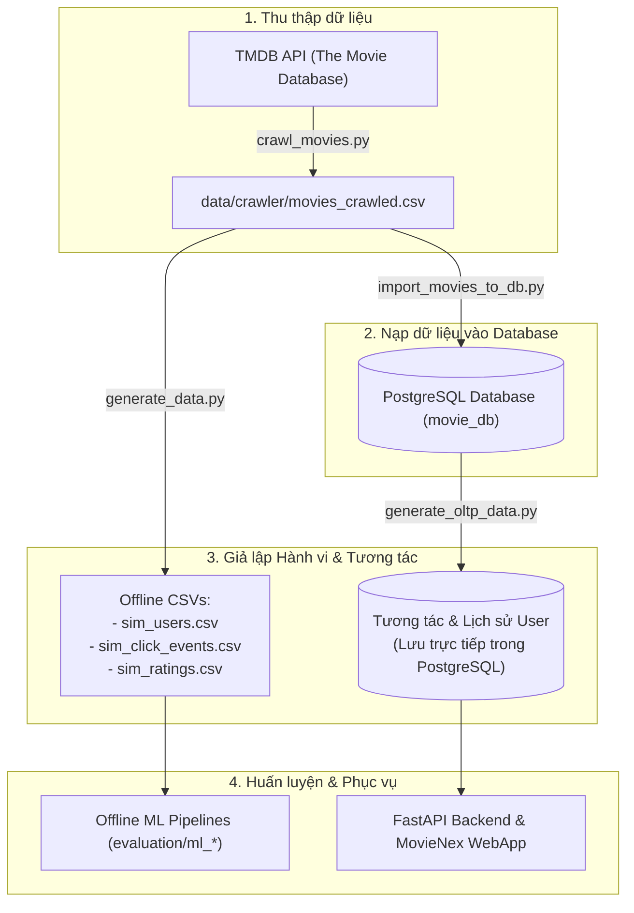

# 📊 Dữ liệu Hệ thống Gợi ý Phim (Movie RecSys Data Layer)

Thư mục `data/` chứa toàn bộ dữ liệu nguồn, các công cụ thu thập dữ liệu (crawler), bộ giả lập tương tác người dùng (simulator), và các tập dữ liệu benchmark phục vụ cho việc huấn luyện, đánh giá và vận hành hệ thống gợi ý phim **MovieNex**.

---

## 🗂️ Cấu trúc Thư mục

```
data/
├── crawler/                           # Thu thập dữ liệu phim thực tế từ TMDB API
│   ├── crawl_movies.py               # Script crawler (2000 - 2026)
│   ├── movies_crawled.csv            # Tập dữ liệu phim thu thập đầy đủ (~5.7 MB)
│   └── movies_crawled_10k.csv        # Tập dữ liệu phim mở rộng 10,000 phim (~5.9 MB)
├── simulator/                         # Bộ giả lập hành vi người dùng & nạp DB
│   ├── README.md                     # Tài liệu chi tiết cơ sở toán học của simulator
│   ├── generate_data.py              # Sinh dữ liệu tương tác CSV (offline training)
│   ├── generate_oltp_data.py         # Sinh dữ liệu tương tác trực tiếp vào PostgreSQL
│   └── import_movies_to_db.py        # Import danh mục phim từ CSV vào PostgreSQL
├── ml-latest-small/                   # Tập dữ liệu benchmark MovieLens (100k ratings)
│   ├── README.txt                    # Mô tả chi tiết từ GroupLens Research
│   ├── movies.csv                    # Danh sách phim MovieLens
│   ├── ratings.csv                   # Lịch sử chấm điểm (userId, movieId, rating, timestamp)
│   ├── tags.csv                      # Gắn thẻ thể loại / nội dung từ người dùng
│   └── links.csv                     # Ánh xạ movieId sang IMDb ID và TMDB ID
└── test_crawl_2026.csv                # File kiểm thử mẫu dữ liệu phim năm 2026
```

---

## 🔄 Quy trình Xử lý Dữ liệu (End-to-End Data Workflow)



---

## 🚀 Hướng dẫn Thực thi Chi tiết

Tất cả các lệnh dưới đây được chạy từ **thư mục gốc của dự án** (`movie-recsys/`).

### Bước 1: Thu thập Dữ liệu Phim từ TMDB API (`crawl_movies.py`)

Script sử dụng `TMDB_API_KEY` từ file `.env` hoặc tham số truyền vào để crawl thông tin phim phát hành từ năm 2000 đến 2026:

```bash
# Sử dụng API Key trong file .env
python data/crawler/crawl_movies.py --start_year 2000 --end_year 2026 --pages 15 --output data/crawler/movies_crawled.csv

# Hoặc truyền trực tiếp API Key qua tham số CLI
python data/crawler/crawl_movies.py --api_key "your_tmdb_api_key" --pages 10
```

**Các trường dữ liệu thu thập:**
- `movieId`, `title`, `release_date`, `genres`, `overview`, `popularity`, `vote_average`, `vote_count`, `poster_url`, `backdrop_url`, `director`, `cast`, `keywords`.

---

### Bước 2: Import Danh mục Phim vào PostgreSQL (`import_movies_to_db.py`)

Trước khi import, hãy đảm bảo container PostgreSQL đang hoạt động (`docker compose up -d postgres`).

```bash
python data/simulator/import_movies_to_db.py \
    --csv_path data/crawler/movies_crawled.csv \
    --host localhost \
    --port 5435 \
    --database movie_db \
    --user postgres \
    --password mysecretpassword
```

Script sẽ tự động:
1. Chuẩn hóa và làm sạch dữ liệu phim từ file CSV.
2. Tạo các bảng cơ sở dữ liệu nếu chưa có (`movies`, `genres`, `movie_genres`, `directors`, `actors`, `movie_actors`).
3. Thực hiện bulk insert với `execute_values` đảm bảo tốc độ cao.

---

### Bước 3: Giả lập Hành vi Người dùng

#### Cách A: Sinh dữ liệu tương tác trực tiếp vào PostgreSQL (Phục vụ WebApp OLTP)
Sử dụng khi bạn muốn tạo lịch sử xem, click, và đánh giá cho ứng dụng web hoạt động thực tế:

```bash
python data/simulator/generate_oltp_data.py \
    --host localhost \
    --port 5435 \
    --database movie_db \
    --user postgres \
    --password mysecretpassword \
    --num_users 150 \
    --cold_start_users_ratio 0.10 \
    --exploration_ratio 0.05
```

#### Cách B: Sinh dữ liệu ra các file CSV (Phục vụ Offline Training & Evaluation)
Sử dụng khi bạn muốn tạo tập dữ liệu huấn luyện các mô hình Machine Learning:

```bash
python data/simulator/generate_data.py \
    --movies_csv data/crawler/movies_crawled.csv \
    --num_users 200 \
    --output_dir data/simulator \
    --cold_start_users_ratio 0.10 \
    --exploration_ratio 0.05
```

Các file sinh ra gồm:
- `data/simulator/sim_users.csv`: Thông tin sở thích (`favorite_genres`), `user_bias`, `activity_level`.
- `data/simulator/sim_click_events.csv`: Lịch sử tương tác phễu (`click`, `detail_view`, `watch_start`, `watch_complete`).
- `data/simulator/sim_ratings.csv`: Điểm đánh giá tường minh ($0.5 - 5.0$ sao kèm timestamp).

---

## 📌 Tập dữ liệu Benchmark MovieLens (`data/ml-latest-small/`)

Dự án tích hợp sẵn bộ dữ liệu chuẩn MovieLens 100k từ GroupLens Research để đối sánh mô hình:
- **100,836 đánh giá** và **3,683 thẻ gắn** trên **9,742 bộ phim**.
- Được tạo bởi **610 người dùng** trong giai đoạn từ 29/03/1996 đến 24/09/2018.
- Toàn bộ người dùng được chọn đều đã đánh giá ít nhất 20 bộ phim.
- Sử dụng trực tiếp trong `evaluation/machine_learning/` và `evaluation/deep_learning/`.
