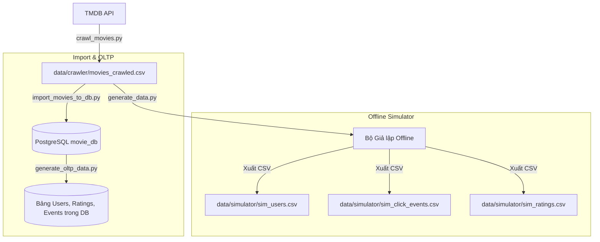

# Bộ Giả lập Tương tác Người dùng Nâng cao (Movie RecSys Data Simulator)

Tài liệu này hướng dẫn chi tiết cách chạy các công cụ giả lập hành vi người dùng (`generate_data.py`, `generate_oltp_data.py`) và nạp dữ liệu vào PostgreSQL (`import_movies_to_db.py`), đồng thời giải thích các cơ sở toán học và phân phối xác suất được áp dụng để tạo ra tập dữ liệu chất lượng cao phục vụ huấn luyện mô hình gợi ý.

---

## 1. Kiến trúc Luồng Dữ liệu (Data Pipeline)

Khác với các bộ sinh dữ liệu ngẫu nhiên thông thường, bộ công cụ này tích hợp trực tiếp với dữ liệu phim thực tế được crawl từ TMDB API:



Dữ liệu đầu ra phản ánh chính xác các yếu tố thực tế như **chất lượng phim**, **sự yêu thích thể loại**, **tính thời điểm (suy giảm theo thời gian)** và **cá tính chấm điểm của người dùng**.

---

## 2. Các Cơ sở Toán học & Thuật toán Giả lập Chuyên nghiệp

### A. Độ phổ biến & Hệ số suy giảm theo thời gian (Time Decay)
Trong hệ thống gợi ý thực tế, phim mới phát hành thường có sức hút lớn hơn phim cũ. Chúng ta sử dụng hàm suy giảm mũ (Exponential Decay) để mô hình hóa xu hướng này:

$$\text{DecayFactor} = e^{-\lambda \cdot \Delta t}$$

*   $\Delta t$: Số ngày kể từ ngày phát hành phim (`release_date`) đến thời điểm người dùng hoạt động.
*   $\lambda = 0.00015$: Hệ số suy giảm (phim cũ đi qua mỗi năm sẽ giảm dần xác suất được đề xuất/click).
*   **Xác suất Click nền tảng**: Điểm số `popularity` thực tế từ TMDB được nhân với $\text{DecayFactor}$ để làm trọng số xác suất click động.

### B. Tần suất hoạt động của Người dùng (User Activity)
Tần suất xem phim của người dùng tuân theo **Phân phối Gamma (Gamma Distribution)**, tạo ra một lượng nhỏ "super-users" (xem rất nhiều phim) và đại đa số người dùng bình thường:

$$f(x; k, \theta) = \frac{x^{k-1} e^{-\frac{x}{\theta}}}{\theta^k \Gamma(k)}$$

*   Cấu hình trong bộ sinh: `shape (k) = 2.5`, `scale (theta) = 40`. Điều này mô phỏng chân thực sự thưa thớt (sparsity) của ma trận tương tác.

### C. Logic Phễu Hành Vi (Behavior Funnel)
Mô phỏng chuỗi sự kiện tương tác của người dùng trên giao diện ứng dụng (như Netflix/Prime):

```
       [ Click Poster ] (Xác suất nền từ Popularity & Decay)
              │
              ▼ (65% Cơ hội)
      [ View Detail (Đọc tóm tắt phim) ]
              │
              ▼ (45% Cơ hội)
      [ Watch Start (Bắt đầu xem phim) ]
         /         \
   (25% Cơ hội)    (75% Cơ hội)
       /             \
[ Tắt giữa chừng ]   [ Watch Complete (Xem hết phim) ]
                      │
                      ▼ (35% Cơ hội)
             [ Chấm điểm Rating ]
```

### D. Điểm đánh giá Cá nhân hóa (Rating Bias Model)
Điểm đánh giá tường minh (explicit ratings) được sinh dựa trên mô hình cộng tuyến tính kinh điển trong Recommendation Systems:

$$\text{Rating}_{u,i} = \mu + b_u + b_i + \text{Similarity}_{u,i} + \text{CompletionBonus}_{u,i} + \epsilon$$

*   $\mu = 3.5$: Điểm trung bình toàn hệ thống.
*   $b_u$: **User Bias** – phản ánh cá tính của user (người dễ tính chấm cao, người khó tính chấm thấp), tuân theo phân phối chuẩn $\mathcal{N}(0, 0.5)$.
*   $b_i$: **Item Bias** – chất lượng cốt lõi của phim, lấy từ điểm đánh giá thực tế `vote_average` của TMDB:
    $$b_i = \frac{\text{vote\_average} - 5.0}{2}$$
*   $\text{Similarity}_{u,i}$: Điểm thưởng $+0.5$ đến $+1.2$ nếu phim thuộc thể loại yêu thích (`favorite_genres`) của user.
*   $\text{CompletionBonus}_{u,i}$: Điểm cộng $+0.3$ đến $+0.8$ nếu xem hết phim, hoặc trừ $-1.5$ đến $-0.5$ nếu tắt giữa chừng.
*   $\epsilon \sim \mathcal{N}(0, 0.35)$: Nhiễu ngẫu nhiên.
*   **Giới hạn & Làm tròn**: Điểm rating được kẹp trong khoảng $[0.5, 5.0]$ và làm tròn về mức $0.5$ sao gần nhất (như hệ thống của MovieLens).

---

## 3. Hướng dẫn Chạy Chi tiết

Chạy các lệnh sau từ **thư mục gốc dự án** (`movie-recsys/`).

### A. Nạp Danh mục Phim vào PostgreSQL (`import_movies_to_db.py`)
Đảm bảo container PostgreSQL đang chạy (`docker compose up -d postgres`):

```bash
python data/simulator/import_movies_to_db.py \
    --csv_path data/crawler/movies_crawled.csv \
    --host localhost \
    --port 5435 \
    --database movie_db \
    --user postgres \
    --password mysecretpassword
```

### B. Sinh Dữ liệu Tương tác trực tiếp vào PostgreSQL (`generate_oltp_data.py`)
Tạo dữ liệu người dùng mô phỏng, lịch sử click phễu, và đánh giá trực tiếp vào database để WebApp có thể hiển thị lịch sử ngay lập tức:

```bash
python data/simulator/generate_oltp_data.py \
    --host localhost \
    --port 5435 \
    --database movie_db \
    --user postgres \
    --password mysecretpassword \
    --num_users 150 \
    --cold_start_users_ratio 0.10 \
    --exploration_ratio 0.05
```

### C. Sinh Dữ liệu Tương tác ra các tệp CSV (`generate_data.py`)
Tạo dữ liệu huấn luyện ngoại tuyến cho các mô hình Machine Learning:

```bash
python data/simulator/generate_data.py \
    --movies_csv data/crawler/movies_crawled.csv \
    --num_users 200 \
    --output_dir data/simulator \
    --cold_start_users_ratio 0.10 \
    --exploration_ratio 0.05
```

#### Các tham số CLI hỗ trợ:
*   `--movies_csv`: Đường dẫn tới file chứa dữ liệu phim thật đã crawl (mặc định: `data/crawler/movies_crawled.csv`).
*   `--num_users`: Số lượng người dùng giả lập cần tạo (mặc định: `200`).
*   `--output_dir`: Thư mục lưu các file CSV đầu ra (mặc định: `data/simulator`).
*   `--cold_start_users_ratio`: Tỷ lệ người dùng khởi đầu lạnh (chưa có tương tác) (mặc định: `0.10`).
*   `--exploration_ratio`: Tỷ lệ click khám phá ngẫu nhiên ngoài vùng sở thích (mặc định: `0.05`).
*   `--cold_start_movies_ratio`: Tỷ lệ phim mới xuất hiện muộn trong chuỗi thời gian (mặc định: `0.20`).

---

## 4. Các Tệp tin Đầu ra (Output Datasets)

Khi chạy `generate_data.py`, 3 tệp tin CSV sau sẽ được tạo ra:

### A. Người dùng (`sim_users.csv`)
Lưu trữ thông tin profile và sở thích của user:
*   `user_id`: ID người dùng (khóa chính).
*   `favorite_genres`: Danh sách các thể loại phim ưa thích (ví dụ: `Action|Sci-Fi`).
*   `activity_level`: Số lượng phim tối đa mà user này sẽ tương tác.
*   `user_bias`: Hệ số chênh lệch điểm số cá nhân ($b_u$).

### B. Sự kiện click (`sim_click_events.csv`)
Lưu trữ log hành vi tương tác ngầm định (implicit feedback):
*   `userId`: ID người dùng.
*   `movieId`: ID bộ phim.
*   `timestamp`: Thời gian xảy ra sự kiện (dạng Unix epoch timestamp).
*   `event_type`: Loại sự kiện (`click`, `detail_view`, `watch_start`, `watch_complete`).

### C. Bảng điểm đánh giá (`sim_ratings.csv`)
Lưu trữ điểm đánh giá tường minh (explicit feedback):
*   `userId`: ID người dùng.
*   `movieId`: ID bộ phim.
*   `rating`: Điểm đánh giá (từ 0.5 đến 5.0 sao, bước nhảy 0.5).
*   `timestamp`: Thời gian đánh giá (dạng Unix epoch timestamp).
