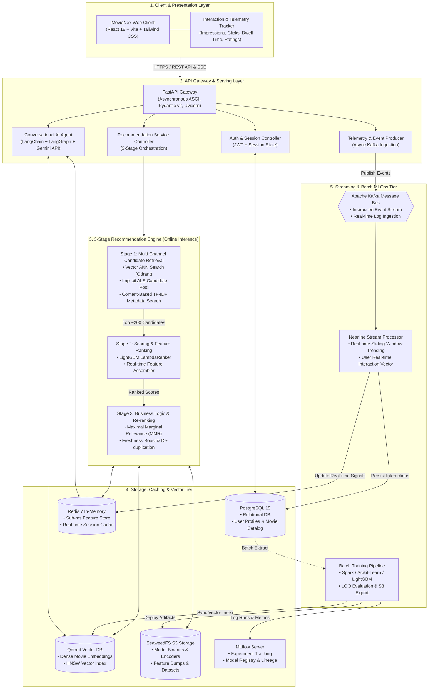
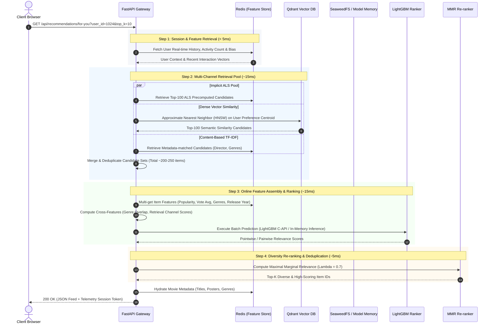

# MovieNex System & Infrastructure Architecture

This document provides the architectural specification for **MovieNex**, an industrial-grade, full-stack movie recommendation and streaming platform. The architecture is engineered to satisfy low-latency online inference SLAs ($\le 50\,\text{ms}$ p95), resilient real-time interaction ingestion, multi-modal vector search, and scalable offline/nearline model lifecycle management.

---

## 1. High-Level System Architecture

MovieNex implements a **Hybrid Lambda/Kappa-inspired Recommender Architecture** that decouples heavy offline batch training from low-latency online inference and nearline event streaming.

---

## 2. End-to-End Online Serving Flow

The online recommendation path is optimized for sub-50ms execution. The sequence below details the dynamic execution flow when a user requests their personalized discovery feed:

---

## 3. Storage & Infrastructure Matrix

| Subsystem | Technology | Storage Type | SLA / Latency | Primary Responsibility |
| :--- | :--- | :--- | :--- | :--- |
| **Relational Database** | PostgreSQL 15 (Alpine) | Persistent Block Store | $< 10\,\text{ms}$ | Source of truth for users, credentials, movie metadata, and explicit ratings. |
| **Online Feature Store** | Redis 7 (In-Memory) | In-Memory Key-Value | $< 1\,\text{ms}$ | Real-time sliding window telemetry, user preference vectors, session state, fast candidate cache. |
| **Vector Search Engine** | Qdrant | Vector Index (HNSW) | $< 15\,\text{ms}$ | High-dimensional dense embeddings of movie synopsis and plot vectors for semantic retrieval. |
| **Object Store** | SeaweedFS (S3 API) | Distributed Object Store | $< 25\,\text{ms}$ | Serialized machine learning models (`.joblib`, `.json`), TF-IDF matrices, and training datasets. |
| **Experiment Platform** | MLflow Server | SQLite / Postgres backend | N/A (Offline) | Model lineage, metric comparisons ($HR@K$, $NDCG@K$), hyperparameter logging, and model registry. |
| **Message Broker** | Apache Kafka (KRaft) | Distributed Commit Log | $< 5\,\text{ms}$ | High-throughput streaming ingestion of impression, click, and dwell-time events. |

---

## 4. Fault Tolerance & Reliability Design

1. **Graceful Degradation (Fallback Hierarchy)**:
   - If **Qdrant** is unreachable $\rightarrow$ Fallback to cached ALS offline candidate lists.
   - If **LightGBM Model Inference** times out $\rightarrow$ Fallback to pure retrieval score sorting + MMR.
   - If **Redis Feature Store** is degraded $\rightarrow$ Fallback to static global popularity rankings (`Trending Now`) served from PostgreSQL or static cache.
2. **Cold-Start Resilience**:
   - **New Users**: Onboarded via genre selection chips or instant contextual retrieval from initial exploratory clicks without requiring model retraining.
   - **New Movies**: Immediately indexed into Qdrant vector space via metadata TF-IDF embeddings, enabling instant discovery without historical interaction logs.
3. **Stateless Serving Nodes**:
   - The FastAPI backend gateway is completely stateless; model artifacts are loaded in memory upon startup and hot-reloaded via background worker signals when new model versions are registered in MLflow.

