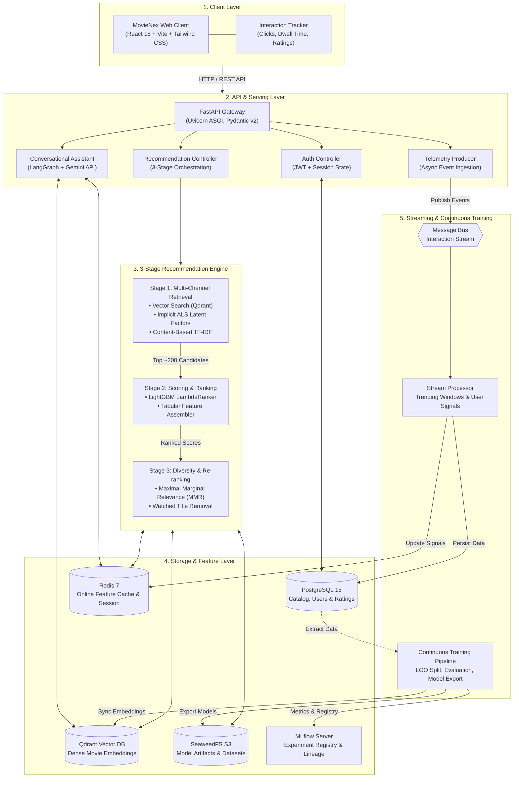

# System & Infrastructure Architecture

This document describes the architecture of **MovieNex**, an end-to-end movie recommendation and streaming platform. The architecture is designed to handle low-latency online inference ($\le 50\,\text{ms}$ p95), real-time user interaction tracking, vector similarity search, and continuous model training.

---

## 1. High-Level System Architecture

MovieNex separates offline batch training, nearline stream processing, and online serving:

---

## 2. Online Serving Flow & Latency Budget

The table below breaks down the serving path for personalized recommendations (`GET /api/recommendations/for-you`):

| Step | Action | Latency Target | Description |
| :--- | :--- | :--- | :--- |
| **1. Session & Context** | Fetch user state | $< 5\,\text{ms}$ | Retrieve recent interaction history, user activity, and rating bias from Redis. |
| **2. Multi-Channel Retrieval** | Generate candidates | $< 15\,\text{ms}$ | Query Implicit ALS factors, TF-IDF metadata index, and Qdrant vector index. Merge into ~200 unique candidates. |
| **3. Heavy Ranking** | Feature assembly & score | $< 15\,\text{ms}$ | Assemble 8 tabular features (`features.py`) and score candidates via LightGBM LambdaRanker in memory. |
| **4. Diversity Re-ranking** | Apply MMR | $< 5\,\text{ms}$ | Re-rank top candidates using MMR ($\lambda = 0.7$) to balance accuracy and genre diversity. |
| **5. Response Hydration** | Format & return | $< 5\,\text{ms}$ | Hydrate movie metadata (posters, genres, titles) from cache/DB and return JSON response. |
| **Total** | End-to-End SLA | **$\le 50\,\text{ms}$** | Full request-response cycle. |

---

## 3. Storage & Infrastructure Matrix

| Subsystem | Technology | Storage Type | Read Latency | Primary Responsibility |
| :--- | :--- | :--- | :--- | :--- |
| **Relational Database** | PostgreSQL 15 | Disk-backed Relational | $< 10\,\text{ms}$ | Persistent storage for user credentials, movie catalog, and explicit ratings. |
| **Online Feature Store** | Redis 7 | In-Memory Key-Value | $< 1\,\text{ms}$ | Sub-millisecond feature lookup, recent interaction cache, and session state. |
| **Vector Database** | Qdrant | Vector Index (HNSW) | $< 15\,\text{ms}$ | Dense embeddings of movie synopses for semantic similarity searches. |
| **Artifact Store** | SeaweedFS (S3) | Object Storage | $< 25\,\text{ms}$ | Storage for trained model files (`lgb_ranker.pkl`, TF-IDF matrices). |
| **ML Platform** | MLflow | Database + S3 | N/A (Offline) | Experiment tracking, parameter logging, and model registry. |
| **Message Broker** | Kafka / Redis Stream | Append-only Log | $< 5\,\text{ms}$ | Ingests real-time user clicks, ratings, and impression events. |

---

## 4. Fault Tolerance & Fallback Strategies

| Failure Scenario | Impact | Fallback Strategy |
| :--- | :--- | :--- |
| **Qdrant Unreachable** | Semantic vector channel unavailable | System falls back to Collaborative Filtering (ALS) and Content-Based TF-IDF candidate pools. |
| **LightGBM Ranking Error** | Stage 2 model scoring fails | Heuristic ranking fallback using linear combination of retrieval score and popularity. |
| **Redis Cache Down** | Online feature store unavailable | Fall back to direct database reads or global `Trending Now` recommendations. |
| **Model Serving Memory Leak** | High memory usage during heavy traffic | Worker processes recycle automatically; model weights are kept immutable in process memory. |

---

## 5. Cold-Start Handling

| Cold-Start Scenario | Strategy | Data Source |
| :--- | :--- | :--- |
| **New User (No ratings)** | Present onboarding genre selector chips; recommend high-popularity and high-rated movies filtered by selected genres. | Static catalog statistics in PostgreSQL / Redis. |
| **New Movie (No ratings)** | Index immediately into Content-Based TF-IDF and Qdrant using title, genres, overview, and director. | Movie metadata crawled or loaded from TMDB. |
| **Sparse User ($< 5$ ratings)** | Balance collaborative latent factor predictions with content-based genre overlap matching. | Hybrid candidate retrieval with dynamic fallback weights. |
