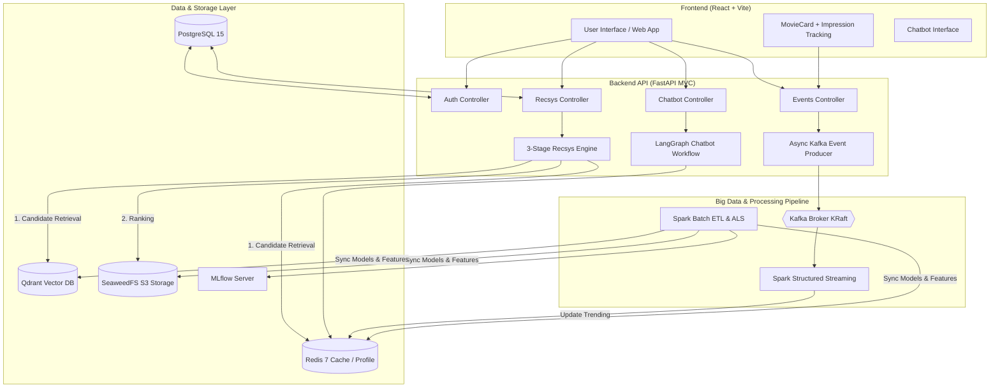
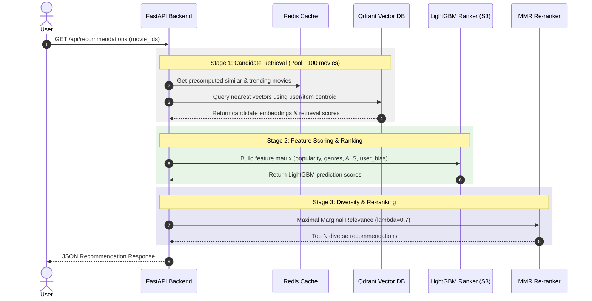

# MovieNex Recommendation System Architecture

Document mô tả chi tiết kiến trúc tổng thể, sơ đồ hệ thống và quy trình xử lý dữ liệu của hệ thống Movie Recommender System (MovieNex).

---

## 1. System Overview (Tổng quan Hệ thống)

MovieNex là hệ thống gợi ý phim 3 giai đoạn (3-Stage Recommendation Architecture) kết hợp giữa Offline Batch Processing, Real-time Event Streaming, Vector Database Search và LLM Chatbot Agent.

---

## 2. Recommendation Engine (3-Stage Engine)

---

## 3. Storage & Infrastructure Stack

| Services | Công nghệ | Vai trò / Nhiệm vụ |
|---|---|---|
| Database | PostgreSQL 15 | Lưu trữ người dùng, preferences, watchlist, ratings |
| Online Store | Redis 7 | Dynamic cache, realtime trending score, user profile & chat history |
| Vector DB | Qdrant | Vector embedding search cho content similarity |
| Object Storage | SeaweedFS (S3) | Lưu trữ model artifacts (LightGBM, CatBoost) |
| Streaming Broker | Apache Kafka (KRaft) | Nhận interaction events (click, impression, rating) |
| Compute | Apache Spark 3.5 | Batch processing, ALS factor calculation, Structured Streaming |
| Experiment | MLflow | Quản lý phiên bản model và tracking metrics |
