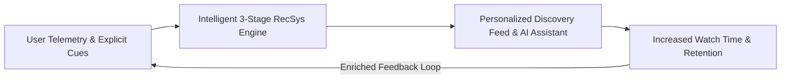
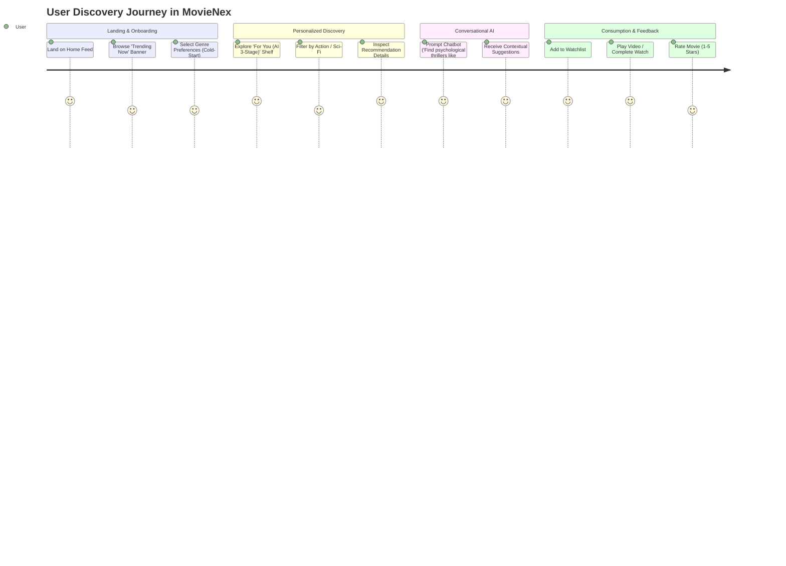
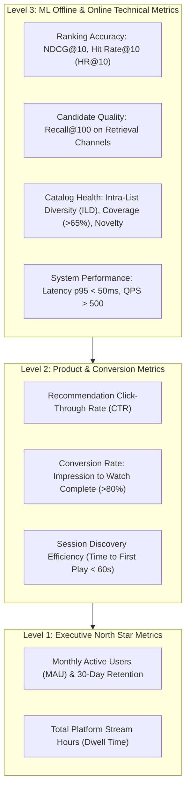

# MovieNex Business Requirements & KPI Framework

This document outlines the product vision, user journey specifications, business objectives, and metric hierarchies governing the **MovieNex** recommendation platform.

---

## 1. Product Vision & Value Proposition

MovieNex is an intelligent movie streaming and discovery ecosystem. The platform addresses the **Paradox of Choice** in video streaming by delivering hyper-personalized, context-aware, and serendipitous recommendations, transforming passive catalog browsing into high-engagement viewing experiences.



---

## 2. User Personas & Discovery Journeys



### Key User Personas
1. **The Casual Streamer (High Velocity, High Popularity Bias)**:
   - Needs instant gratification; heavily converts on *Trending Now*, high IMDb/TMDB scores, and visual trailer banners.
2. **The Genre Cinephile (Deep Niche, Low Popularity Bias)**:
   - Values director-based clustering, actor filmographies, thematic consistency, and catalog novelty.
3. **The Undecided Explorer (High Dwell Time)**:
   - Seeks interactive conversational discovery via the **AI Assistant** using semantic prompts (e.g., *"Mind-bending sci-fi movies from the 90s with minimal CGI"*).

---

## 3. Metric Hierarchy: Business KPIs vs. Technical Objectives

To bridge machine learning models with business impact, MovieNex organizes metrics into an operational hierarchy:



### Mathematical Metric Definitions

1. **Hit Rate at K ($HR@K$)**:
   $$\text{HR@K} = \frac{1}{|U|} \sum_{u \in U} \mathbb{I}(\text{rank}_{u, i^*} \le K)$$
   *Measures the proportion of users for whom the true ground-truth item $i^*$ is within the top $K$ recommendations.*

2. **Normalized Discounted Cumulative Gain ($NDCG@K$)**:
   $$\text{DCG@K} = \sum_{r=1}^{K} \frac{2^{y_r} - 1}{\log_2(r + 1)}, \quad \text{NDCG@K} = \frac{\text{DCG@K}}{\text{IDCG@K}}$$
   *Evaluates position-weighted relevance, heavily penalizing high-value recommendations placed lower in the feed.*

3. **Intra-List Diversity ($ILD$)**:
   $$\text{ILD}(R) = \frac{2}{|R|(|R|-1)} \sum_{i \in R} \sum_{j \in R, j \ne i} \left(1 - \text{CosineSim}(\mathbf{v}_i, \mathbf{v}_j)\right)$$
   *Quantifies catalog dispersion within the recommended slate $R$ to prevent hyper-specialization and recommendation fatigue.*

---

## 4. Cold-Start & Exploration Strategy

```mermaid
flowchart TD
    UserArrival{"User Status"}
    UserArrival -->|New User (Zero History)| CS_User["Cold-Start Strategy<br/>1. TMDB Global Popularity Prior<br/>2. Interactive Genre Chips Onboarding<br/>3. Real-time In-Session Epsilon-Greedy Exploration"]
    UserArrival -->|New Movie (Zero Interactions)| CS_Item["New Item Strategy<br/>1. Dense Synopsis Embedding via Qdrant<br/>2. Content TF-IDF Soup (Cast/Director/Genres)<br/>3. Exploration Slot Injection (10% Traffic)"]
    UserArrival -->|Active User (>5 Events)| Warm["Personalized 3-Stage Engine<br/>iALS + Vector ANN + LightGBM + MMR"]
```

---

## 5. Non-Functional Requirements & Engineering SLAs

| Requirement Category | Metric / Specification | Target Threshold |
| :--- | :--- | :--- |
| **Online Latency** | End-to-end API response time (p95) | $\le 50\,\text{ms}$ |
| **Throughput** | Peak concurrent recommendations per node | $\ge 1,000\,\text{QPS}$ |
| **Availability** | Multi-zone service uptime | $\ge 99.95\%$ |
| **Freshness (Telemetry)** | Latency from client click to online feature update | $\le 500\,\text{ms}$ |
| **Model Retraining** | Automated batch pipeline retraining cadence | Daily (24-hour cycle) |
| **Catalog Coverage** | Percentage of unique catalog items recommended weekly | $\ge 70\%$ |
