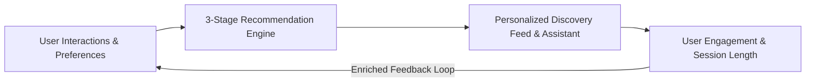
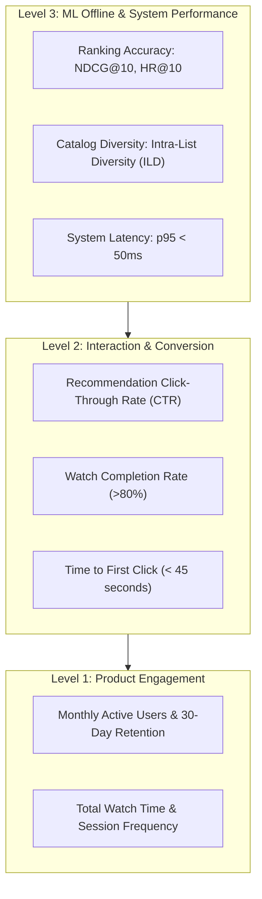

# Business Requirements & Metric Framework

This document outlines the product requirements, user personas, metric framework, and service-level objectives for **MovieNex**.

---

## 1. Product Goals

MovieNex helps users discover movies matching their personal taste while introducing catalog diversity. The system balances accuracy, discovery speed, and diversity through a 3-stage recommendation architecture and conversational search.

---

## 2. User Personas & Discovery Journeys

| Persona | Characteristics | Primary Discovery Journey |
| :--- | :--- | :--- |
| **Casual Viewer** | Seeks immediate recommendations; high popularity preference. | Converts primarily via *Trending Now* and top-rated discovery shelves. |
| **Genre Enthusiast** | Clear thematic preferences (e.g., Sci-Fi, Film Noir); low popularity bias. | Explores specific genre filters and director/cast connections. |
| **Undecided Explorer** | Looking for serendipitous or specific mood-based discovery. | Uses the conversational assistant (e.g., *"Show me atmospheric mystery thrillers like Memento"*). |

---

## 3. Metric Framework

To track recommendation performance, metrics are organized across three levels:

### Metric Definitions & Target Objectives

| Metric | Level | Mathematical Formula | Target Objective |
| :--- | :--- | :--- | :--- |
| **Hit Rate ($HR@K$)** | Offline ML | $\frac{1}{\|U\|} \sum_{u \in U} \mathbb{I}(\text{rank}_{u, i^*} \le K)$ | $\ge 0.35$ on Leave-One-Out test sets. |
| **NDCG ($NDCG@K$)** | Offline ML | $\frac{\text{DCG@K}}{\text{IDCG@K}}$ where $\text{DCG@K} = \sum_{r=1}^{K} \frac{2^{y_r} - 1}{\log_2(r + 1)}$ | $\ge 0.20$ on top-10 candidate slates. |
| **Intra-List Diversity ($ILD$)** | Offline ML | $\frac{2}{\|R\|(\|R\|-1)} \sum_{i, j \in R, j \ne i} (1 - \text{CosineSim}(\mathbf{v}_i, \mathbf{v}_j))$ | Maintained $\ge 0.40$ via MMR re-ranking. |
| **Recommendation CTR** | Online Product | $\frac{\text{Total Recommendation Clicks}}{\text{Total Recommendation Impressions}}$ | $\ge 8.0\%$ across personalized shelves. |
| **Time to First Play** | Online Product | Elapsed seconds from page load to media playback | $\le 60\,\text{seconds}$ average. |

---

## 4. Cold-Start Strategies

| Scenario | Challenge | Applied Solution |
| :--- | :--- | :--- |
| **New User** | No historical ratings or interaction logs. | Interactive genre chip selection during initial visit; fallback to popularity and high-rating priors. |
| **New Item** | Newly added movie with zero interaction data. | Indexed into Qdrant using synopsis embeddings and TF-IDF metadata (genres, director, cast). |
| **Sparse History** | User with fewer than 5 ratings. | Hybrid retrieval balancing content-based genre overlap with global collaborative trends. |

---

## 5. Engineering SLAs & Non-Functional Requirements

| Metric / Category | Specification | Target Threshold |
| :--- | :--- | :--- |
| **Online Serving Latency** | End-to-end API response time (p95) | $\le 50\,\text{ms}$ |
| **Continuous Training Latency Gate** | Pipeline batch evaluation latency | $< 30\,\text{ms}$ |
| **Database Read Latency** | Primary catalog query latency | $< 10\,\text{ms}$ |
| **Cache Lookup Latency** | In-memory feature retrieval from Redis | $< 1\,\text{ms}$ |
| **System Uptime** | Availability of API and recommendation engine | $\ge 99.9\%$ |
