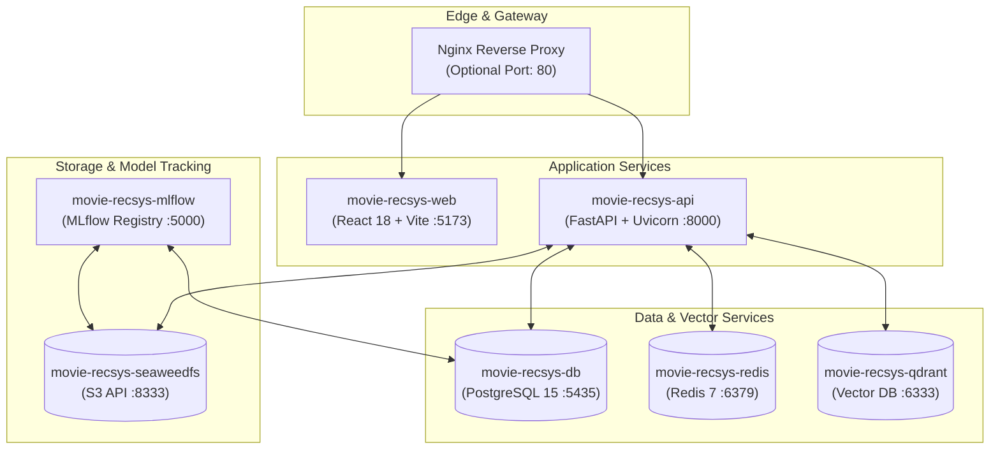
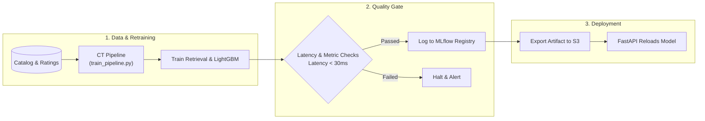

# Production Deployment & MLOps Infrastructure

This document describes the container setup, continuous training lifecycle, environment configuration, and monitoring procedures for **MovieNex**.

---

## 1. Container Topology

The application stack is managed using Docker Compose:



### Services Summary

| Service | Container Name | Port | Description |
| :--- | :--- | :--- | :--- |
| **API Gateway** | `movie-recsys-api` | `8000` | FastAPI backend for recommendation inference, auth, and chatbot. |
| **Web Frontend** | `movie-recsys-web` | `5173` | React application serving the movie streaming interface. |
| **Relational DB** | `movie-recsys-db` | `5435` | PostgreSQL database storing users, ratings, and catalog metadata. |
| **Feature Store / Cache** | `movie-recsys-redis` | `6379` | In-memory store for session caching and feature retrieval. |
| **Vector DB** | `movie-recsys-qdrant` | `6333` | Qdrant vector database for plot synopsis embedding search. |
| **Object Storage** | `movie-recsys-seaweedfs` | `8333` | S3-compatible storage for trained models and data dumps. |
| **ML Tracking** | `movie-recsys-mlflow` | `5000` | MLflow tracking server and model registry. |

---

## 2. Continuous Training (CT) Lifecycle

The continuous training workflow updates and validates ranking models before publishing:



### Quality Gate SLA Thresholds

| Metric | Target SLA | Action on Failure |
| :--- | :--- | :--- |
| **Average Latency** | $< 30.0\,\text{ms}$ per request | Pipeline execution halts; old model remains active. |
| **NDCG@10** | Above baseline ($> 0.15$) | Prevents deployment of degraded models. |
| **Feature Schema** | Exact 8 columns | Model cannot be saved if feature dimensions mismatch. |

---

## 3. Environment Variables Configuration

Configure your deployment secrets in `.env`:

| Variable | Default Value | Description |
| :--- | :--- | :--- |
| `POSTGRES_USER` | `postgres` | Database admin user. |
| `POSTGRES_PASSWORD` | `mysecretpassword` | Database password. |
| `POSTGRES_DB` | `movie_db` | Primary database name. |
| `DB_HOST` | `postgres` | Host address of the database. |
| `DB_PORT` | `5432` | PostgreSQL internal network port. |
| `REDIS_HOST` | `redis` | Redis service hostname. |
| `REDIS_PORT` | `6379` | Redis connection port. |
| `QDRANT_HOST` | `qdrant` | Qdrant vector search hostname. |
| `QDRANT_PORT` | `6333` | Qdrant HTTP API port. |
| `MLFLOW_TRACKING_URI` | `http://localhost:5000` | MLflow server endpoint. |
| `TMDB_API_KEY` | *(Secret)* | The Movie Database API key for posters and metadata. |
| `GEMINI_API_KEY` | *(Secret)* | Google Gemini API key for conversational AI assistant. |

---

## 4. Runbook & Common Operations

### 4.1. Starting Infrastructure Services
```bash
# Start storage, vector database, and MLflow
make infra
# or: docker compose up -d
```

### 4.2. Health Verification Commands

| Component | Healthcheck Command | Expected Response |
| :--- | :--- | :--- |
| **PostgreSQL** | `docker exec -it movie-recsys-db pg_isready -U postgres -d movie_db` | `accepting connections` |
| **Redis** | `docker exec -it movie-recsys-redis redis-cli ping` | `PONG` |
| **Qdrant** | `curl -f http://localhost:6333/cluster/status` | HTTP 200 OK |
| **FastAPI Backend** | `curl -f http://localhost:8000/api/health` | `{"status": "ok"}` |

### 4.3. Triggering Continuous Training Manually
```bash
make train
# or: python pipelines/training/train_pipeline.py
```

### 4.4. Running Full Test Suite
```bash
make test
```
