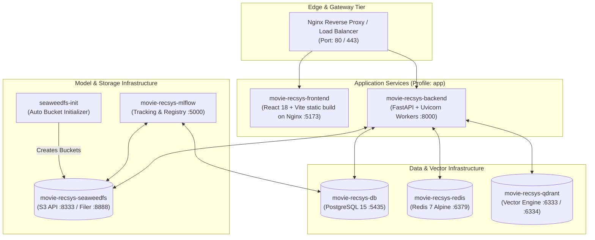
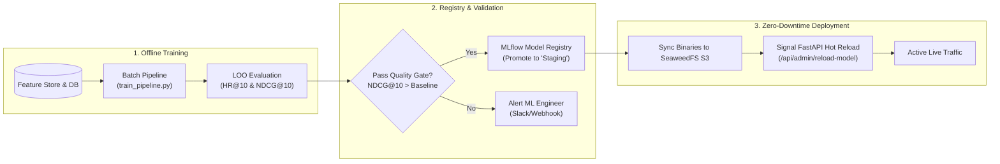
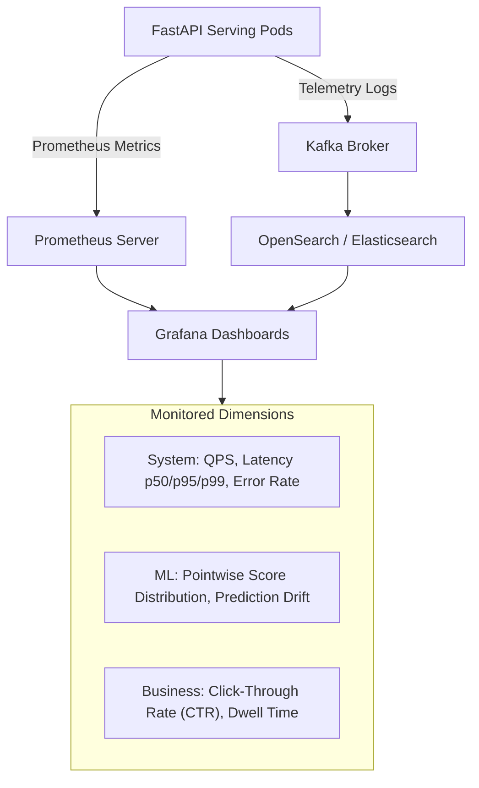

# Production Deployment & MLOps Infrastructure

This document specifies the containerized deployment topology, CI/CD automation, model registry workflow, and telemetry observability stack for the **MovieNex** recommendation platform.

---

## 1. Containerized Service Topology

MovieNex is orchestrated via Docker Compose for local/staging environments and designed for seamless transition to Kubernetes (EKS/GKE).



---

## 2. CI/CD & Model Promotion Lifecycle



---

## 3. Environment Variables & Secret Configuration

Production environments are configured via `.env` files:

```bash
# Core Database Configuration
POSTGRES_USER=postgres
POSTGRES_PASSWORD=mysecretpassword
POSTGRES_DB=movie_db
DB_HOST=postgres
DB_PORT=5432

# Redis Cache & Online Feature Store
REDIS_HOST=redis
REDIS_PORT=6379

# Qdrant Vector Engine
QDRANT_HOST=qdrant
QDRANT_PORT=6333

# Object Storage (SeaweedFS S3-Compatible)
AWS_ACCESS_KEY_ID=seaweedfskey
AWS_SECRET_ACCESS_KEY=seaweedfssecret
SEAWEEDFS_FILER_URL=http://seaweedfs:8888
MLFLOW_S3_ENDPOINT_URL=http://seaweedfs:8333

# External APIs & LLM Providers
TMDB_API_KEY=your_tmdb_api_key
GEMINI_API_KEY=your_gemini_api_key
```

---

## 4. Production Runbook

### 4.1. Starting the Entire Infrastructure
```bash
# Launch storage, cache, vector DB, and MLflow
docker compose up -d postgres redis qdrant seaweedfs seaweedfs-init mlflow

# Launch full application stack (including Frontend & Backend)
docker compose --profile app up -d
```

### 4.2. Healthcheck & Diagnostic Verification
```bash
# Verify PostgreSQL readiness
docker exec -it movie-recsys-db pg_isready -U postgres -d movie_db

# Check Redis responsiveness
docker exec -it movie-recsys-redis redis-cli ping

# Check Qdrant cluster telemetry
curl -f http://localhost:6333/cluster/status

# Check SeaweedFS cluster status
curl -f http://localhost:9333/cluster/status
```

---

## 5. Monitoring & Observability Architecture



1. **Service Metrics**: End-to-end inference latency, throughput (QPS), and cache hit ratios.
2. **Data & Prediction Drift**: Monitored by logging candidate score distributions. Significant distribution drift triggers automated retraining pipelines.
3. **Rollback Mechanism**: If online metric degradation is observed, FastAPI serving instances fall back to previous stable model versions directly from MLflow within $< 10$ seconds.
