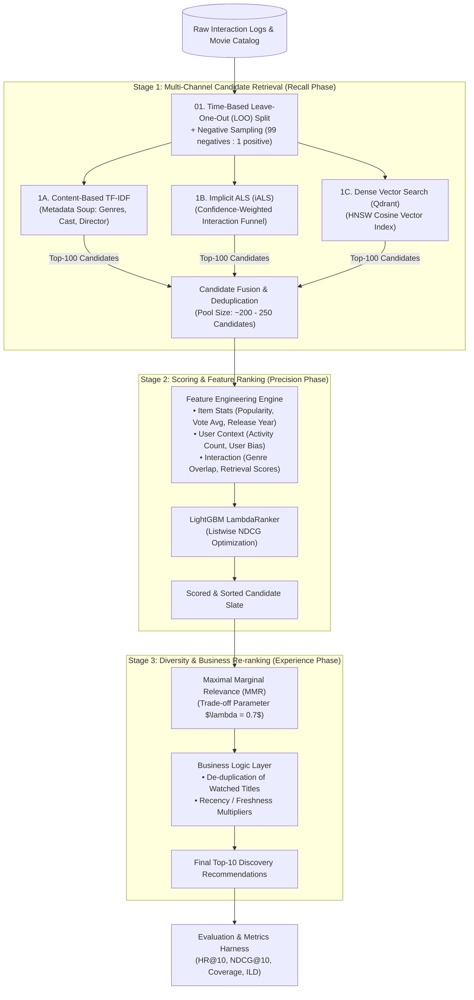
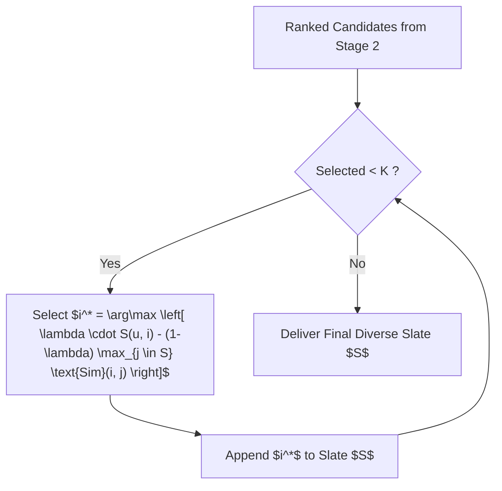

# Industrial 3-Stage Machine Learning Recommendation Pipeline

This document delivers an in-depth technical specification of the **3-Stage Recommendation Pipeline** implemented in MovieNex. The architecture adopts the production paradigm standard across large-scale commercial systems (e.g., Netflix, YouTube, TikTok), decoupling coarse high-recall retrieval from fine-grained high-precision scoring and diversity re-ranking.

---

## 1. End-to-End Pipeline Architecture



---

## 2. Step-by-Step Technical Breakdown

### Step 1: Data Preparation & Temporal Validation Split
- **Time-Based Leave-One-Out (LOO)**: To prevent **temporal data leakage**, the final interaction (by timestamp $t$) of each user is sequestered for the test set. All prior events ($< t$) constitute the training matrix.
- **Negative Sampling Harness**: For each evaluation user, the single ground-truth positive item is mixed with 99 randomly sampled unobserved items to form an evaluation slate of 100 items.

---

### Step 2: Multi-Channel Candidate Retrieval (Stage 1)
Reduces the search space from thousands of movies down to $200\text{--}250$ candidates within $< 15\,\text{ms}$:

```mermaid
flowchart LR
    User["Target User $u$"]
    User -->|Interaction History| ALS["iALS Factorizer"]
    User -->|Favorite Attributes| CB["TF-IDF Vectorizer"]
    User -->|Embedding Centroid| Qdrant["Qdrant HNSW"]

    ALS -->|Score $s_{\text{als}}$| Pool["Fused Candidate Pool"]
    CB -->|Score $s_{\text{cb}}$| Pool
    Qdrant -->|Score $s_{\text{vec}}$| Pool
```

1. **Content-Based Filtering (TF-IDF)**:
   - Constructs a rich feature soup: $\text{Soup} = \text{Genres} \oplus \text{Director} \oplus \text{Top Cast} \oplus \text{Keywords}$.
   - Extracts unigram/bigram token weights via TF-IDF and computes Cosine similarity against the user's historical profile vector.
2. **Collaborative Filtering (Implicit ALS)**:
   - Encodes behavior funnel weights into confidence matrix $\mathbf{C}$:
     $$\text{Click (1.0)} \rightarrow \text{Detail View (2.0)} \rightarrow \text{Watch Start (3.0)} \rightarrow \text{Watch Complete (5.0)}$$
   - Computes low-rank latent dot products $\hat{r}_{ui} = \mathbf{x}_u^T \mathbf{y}_i$.
3. **Dense Vector Search (Qdrant ANN)**:
   - Queries HNSW indexed dense embeddings of plot synopses to retrieve semantic matches.

---

### Step 3: Feature Engineering & Heavy Ranking (Stage 2)
Assembles a rich 8-dimensional feature vector for each candidate $(u, i)$ pair:

| Feature Name | Category | Description |
| :--- | :--- | :--- |
| `popularity` | Item Feature | Log-scaled total interaction count of movie $i$. |
| `vote_average` | Item Feature | Normalized average rating from TMDB/MovieLens. |
| `release_year` | Item Feature | Normalized year of movie release (recency proxy). |
| `user_activity` | User Feature | Total interaction volume of user $u$. |
| `user_bias` | User Feature | Difference between user mean rating and global mean rating. |
| `genre_overlap` | Cross Feature | Count of intersecting genres between candidate $i$ and user's top-3 preferred genres. |
| `als_score` | Retrieval Feature | Latent factor prediction score from Stage 1 iALS. |
| `cb_score` | Retrieval Feature | Cosine similarity score from Stage 1 Content-Based TF-IDF. |

**Model Choice**: `LGBMRanker` trained with `objective="lambdarank"` and `eval_at=[5, 10]`.

---

### Step 4: Diversity Re-ranking via MMR (Stage 3)
Prevents genre clustering (e.g., recommending 10 Marvel superhero movies simultaneously) using **Maximal Marginal Relevance**:



---

## 3. Pipeline Notebooks & Implementation Mapping

| File | Pipeline Role | Primary Objective |
| :--- | :--- | :--- |
| [`01_data_preparation.ipynb`](../evaluation/ml_pipeline/01_data_preparation.ipynb) | Data Pipeline | LOO temporal splitting, negative sampling, matrix generation. |
| [`02_content_based_retrieval.ipynb`](../evaluation/ml_pipeline/02_content_based_retrieval.ipynb) | Stage 1A Retrieval | TF-IDF metadata soup vectorizer and Cosine retrieval. |
| [`03_collaborative_filtering.ipynb`](../evaluation/ml_pipeline/03_collaborative_filtering.ipynb) | Stage 1B Retrieval | Implicit ALS factorization with funnel confidence weights. |
| [`04_lightgbm_ranker.ipynb`](../evaluation/ml_pipeline/04_lightgbm_ranker.ipynb) | Stage 2 Ranking | Feature extraction and LightGBM LambdaRanker training. |
| [`05_mmr_reranking.ipynb`](../evaluation/ml_pipeline/05_mmr_reranking.ipynb) | Stage 3 Re-ranking | MMR diversity optimization and ablation study. |
| [`06_end_to_end_pipeline.ipynb`](../evaluation/ml_pipeline/06_end_to_end_pipeline.ipynb) | End-to-End | Integrated benchmark evaluating $HR@10$, $NDCG@10$, and ILD. |
| [`07_catboost_vs_lightgbm.ipynb`](../evaluation/ml_pipeline/07_catboost_vs_lightgbm.ipynb) | Model Comparison | Benchmark comparing LightGBM vs. CatBoost YetiRank. |
