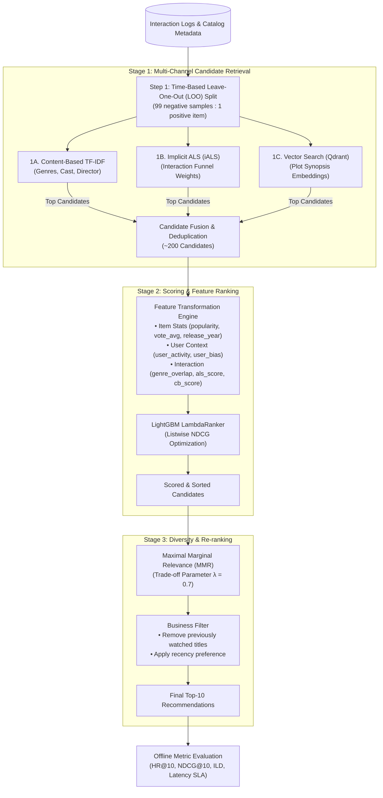

# 3-Stage Recommendation Pipeline Specification

This document details the design and implementation of the **3-Stage Recommendation Pipeline** used in MovieNex. The pipeline decouples candidate retrieval, ranking, and diversity re-ranking to balance recommendation quality, catalog coverage, and response latency.

---

## 1. Pipeline Overview

---

## 2. Stage Breakdown & Details

### Stage Summary

| Stage | Method | Input | Latency Budget | Target Output |
| :--- | :--- | :--- | :--- | :--- |
| **Stage 1: Retrieval** | TF-IDF, Implicit ALS, Qdrant HNSW | User historical interactions and item metadata | $\le 15\,\text{ms}$ | ~200 candidate IDs |
| **Stage 2: Ranking** | LightGBM LambdaRanker | 8-feature tabular representation | $\le 10\,\text{ms}$ | Ranked candidate list |
| **Stage 3: Re-ranking** | Maximal Marginal Relevance (MMR) | Ranking scores and genre representation | $\le 5\,\text{ms}$ | Top-10 diverse slate |

---

### Step 1: Data Preparation & Validation Split
- **Time-Based Leave-One-Out (LOO)**: For each user, the latest interaction by timestamp is assigned to the evaluation test set. Earlier interactions are used for model training. This prevents temporal data leakage.
- **Negative Sampling**: During continuous training quality-gate checks, 1 ground-truth positive item is evaluated alongside 99 randomly selected unobserved items.

---

### Step 2: Multi-Channel Retrieval (Stage 1)

| Channel | Method | Description |
| :--- | :--- | :--- |
| **Content-Based** | TF-IDF + Cosine Similarity | Builds token matrices from genre, director, and keyword metadata. Measures similarity with user preference profiles. |
| **Collaborative Filtering** | Implicit ALS (iALS) | Models implicit user behavior with confidence values: $\text{Click (1.0)} \rightarrow \text{Detail (2.0)} \rightarrow \text{Watch (3.0)}$. Computes latent dot products $\mathbf{x}_u^T \mathbf{y}_i$. |
| **Dense Semantic Search** | Qdrant HNSW Index | Queries pre-computed sentence embeddings of movie synopses to retrieve thematically relevant titles. |

---

### Step 3: Feature Engineering & Ranking (Stage 2)

Candidates from Stage 1 are transformed into an 8-dimensional feature vector matching both offline training and online serving (`libs/recsys_core/src/recsys_core/features.py`):

| Feature Name | Category | Description | Normalization / Scale |
| :--- | :--- | :--- | :--- |
| `popularity` | Item | Total user interaction volume for movie $i$. | Log-scaled continuous value. |
| `vote_average` | Item | Average review score from TMDB/MovieLens dataset. | Scale $0.0\text{--}10.0$. |
| `release_year` | Item | Release year of the movie. | Integer year (fallback: 2010). |
| `user_activity` | User | Number of interactions by user $u$. | Log-transformed: $\log(1 + N_{\text{ratings}})$. |
| `user_bias` | User | Mean rating of user $u$ minus catalog mean rating. | Zero-centered continuous value. |
| `genre_overlap` | Cross | Count of overlapping genres between candidate and user profile. | Non-negative integer. |
| `als_score` | Retrieval | Dot product between user and item ALS latent factors. | Continuous score ($\approx -1.0\text{--}1.0$). |
| `cb_score` | Retrieval | Overlap ratio normalized by user genre set size. | Continuous value in $[0.0, 1.0]$. |

#### Ranking Hyperparameters (`pipelines/training/configs.yaml`)

| Parameter | Value | Purpose |
| :--- | :--- | :--- |
| `objective` | `lambdarank` | Optimizes listwise ranking directly. |
| `metric` | `ndcg` | Evaluates normalized discounted cumulative gain. |
| `eval_at` | `[5, 10]` | Evaluation cut-offs for early stopping. |
| `n_estimators` | `100` | Maximum tree boosting iterations. |
| `learning_rate` | `0.05` | Shrinkage rate per tree update. |
| `num_leaves` | `15` | Controls model capacity and prevents overfitting. |
| `min_child_samples` | `5` | Minimum observations required per leaf. |

---

### Step 4: Diversity Re-ranking (Stage 3)

To prevent redundant recommendations (e.g., all superhero sequels), **Maximal Marginal Relevance (MMR)** selects items sequentially:

$$\text{MMR}(u, i, S) = \operatorname{argmax}_{i \in C \setminus S} \left[ \lambda \cdot \text{Score}(u, i) - (1 - \lambda) \cdot \max_{j \in S} \text{Sim}(i, j) \right]$$

- $C$: Ranked candidates from Stage 2.
- $S$: Slate of already selected items.
- $\text{Sim}(i, j)$: Jaccard similarity across genre vectors.
- $\lambda = 0.7$: Tuned trade-off parameter between relevance ($0.7$) and diversity ($0.3$).

---

## 3. Implementation Notebooks & Scripts

| Notebook / Script | Location | Description |
| :--- | :--- | :--- |
| Data Preparation | [`notebooks/04_pipeline_prototypes/01_data_preparation.ipynb`](../notebooks/04_pipeline_prototypes/01_data_preparation.ipynb) | LOO temporal split and interaction matrix assembly. |
| Content-Based Retrieval | [`notebooks/04_pipeline_prototypes/02_content_based_retrieval.ipynb`](../notebooks/04_pipeline_prototypes/02_content_based_retrieval.ipynb) | TF-IDF feature extraction and cosine candidate generation. |
| Collaborative Filtering | [`notebooks/04_pipeline_prototypes/03_collaborative_filtering.ipynb`](../notebooks/04_pipeline_prototypes/03_collaborative_filtering.ipynb) | Implicit ALS model tuning and factor export. |
| LightGBM Ranker | [`notebooks/04_pipeline_prototypes/04_lightgbm_ranker.ipynb`](../notebooks/04_pipeline_prototypes/04_lightgbm_ranker.ipynb) | Feature preparation and LambdaRank model training. |
| MMR Re-ranking | [`notebooks/04_pipeline_prototypes/05_mmr_reranking.ipynb`](../notebooks/04_pipeline_prototypes/05_mmr_reranking.ipynb) | MMR diversity tuning and Intra-List Distance (ILD) checks. |
| End-to-End Pipeline | [`notebooks/04_pipeline_prototypes/06_end_to_end_pipeline.ipynb`](../notebooks/04_pipeline_prototypes/06_end_to_end_pipeline.ipynb) | Complete 3-stage validation against baseline models. |
| Model Comparison | [`notebooks/04_pipeline_prototypes/07_catboost_vs_lightgbm.ipynb`](../notebooks/04_pipeline_prototypes/07_catboost_vs_lightgbm.ipynb) | Offline comparison between LightGBM and CatBoost YetiRank. |
| Continuous Training Script | [`pipelines/training/train_pipeline.py`](../pipelines/training/train_pipeline.py) | 1-click script for retraining, SLA verification, and MLflow logging. |
