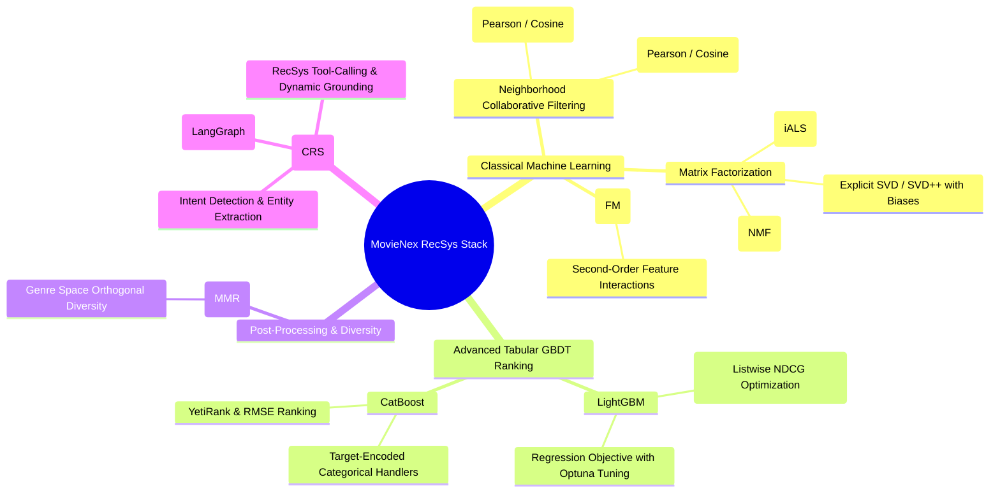
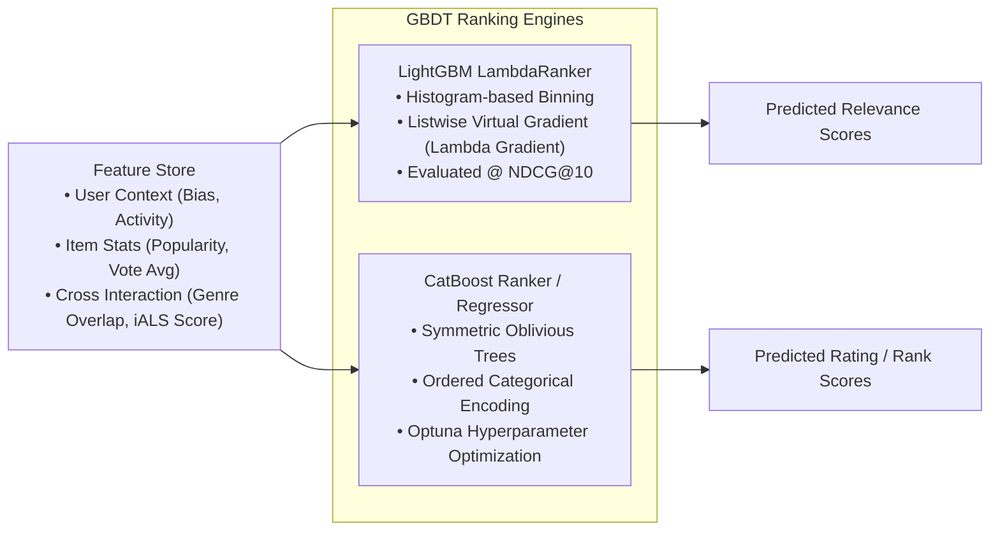
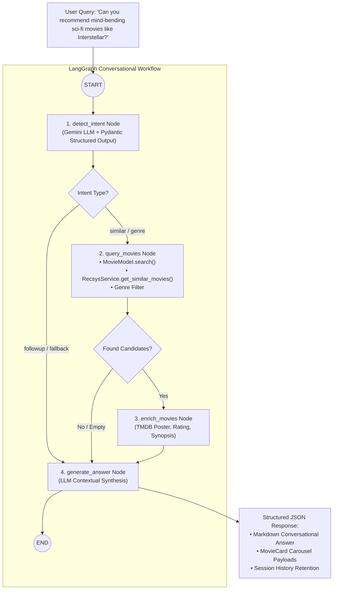

# Applied Machine Learning & Conversational Recommendation Systems

This document delivers the technical and algorithmic specification of the machine learning methods and **Conversational Recommender System (CRS)** implemented in **MovieNex**. The project's applied ML stack focuses on scalable collaborative filtering, tabular Gradient Boosted Decision Trees (**LightGBM** & **CatBoost**), diversity optimization (**MMR**), and agentic dialogue workflows (**LangGraph + Gemini**).

---

## 1. Implemented Algorithmic Scope



---

## 2. Mathematical Formulations of Implemented ML Models

### 2.1. Neighborhood Collaborative Filtering
- **Pearson Correlation for User-Based Similarity**:
  $$\text{Sim}(u, v) = \frac{\sum_{i \in I_{uv}} (r_{ui} - \bar{r}_u)(r_{vi} - \bar{r}_v)}{\sqrt{\sum_{i \in I_{uv}} (r_{ui} - \bar{r}_u)^2} \sqrt{\sum_{i \in I_{uv}} (r_{vi} - \bar{r}_v)^2}}$$
  Normalizes for individual user rating tendencies (optimistic vs. strict raters).

---

### 2.2. Matrix Factorization (Explicit SVD & Implicit ALS)
- **Explicit SVD with Biases**:
  $$\hat{r}_{ui} = \mu + b_u + b_i + \mathbf{p}_u^T \mathbf{q}_i$$
  $$\min_{P, Q, b} \sum_{(u, i) \in \mathcal{K}} \left( r_{ui} - (\mu + b_u + b_i + \mathbf{p}_u^T \mathbf{q}_i) \right)^2 + \lambda \left( \|\mathbf{p}_u\|_2^2 + \|\mathbf{q}_i\|_2^2 + b_u^2 + b_i^2 \right)$$

- **Implicit ALS (iALS)**:
  Transforms raw interaction counts $r_{ui}$ into binary preferences $p_{ui} \in \{0, 1\}$ with confidence weights $c_{ui} = 1 + \alpha r_{ui}$:
  $$\mathcal{L}_{\text{iALS}} = \sum_{u, i} c_{ui} \left( p_{ui} - \mathbf{x}_u^T \mathbf{y}_i \right)^2 + \lambda \left( \sum_u \|\mathbf{x}_u\|_2^2 + \sum_i \|\mathbf{y}_i\|_2^2 \right)$$
  Solved efficiently via alternating closed-form updates: $\mathbf{x}_u = (\mathbf{Y}^T \mathbf{C}^u \mathbf{Y} + \lambda \mathbf{I})^{-1} \mathbf{Y}^T \mathbf{C}^u \mathbf{p}(u)$.

---

### 2.3. Factorization Machines (FM)
Models all pairwise feature interactions in linear time $\mathcal{O}(k \cdot d)$:
$$\hat{y}(\mathbf{x}) = w_0 + \sum_{j=1}^d w_j x_j + \sum_{j=1}^d \sum_{l=j+1}^d \langle \mathbf{v}_j, \mathbf{v}_l \rangle x_j x_l = w_0 + \sum_{j=1}^d w_j x_j + \frac{1}{2} \sum_{f=1}^k \left[ \left( \sum_{j=1}^d v_{j, f} x_j \right)^2 - \sum_{j=1}^d v_{j, f}^2 x_j^2 \right]$$

---

### 2.4. GBDT Ranking: LightGBM LambdaRank vs. CatBoost



#### Optimization Objectives:
1. **LightGBM LambdaRank**: Optimizes permutation rank by weighting pairwise gradients with absolute NDCG changes:
   $$\lambda_{ij} = \frac{-\sigma}{1 + e^{\sigma(s_i - s_j)}} |\Delta \text{NDCG}_{ij}|$$
2. **CatBoost Regression / YetiRank**: Evaluates regression loss $\mathcal{L}_{\text{RMSE}} = \sqrt{\frac{1}{N}\sum (y_i - \hat{y}_i)^2}$ tuned with Optuna (`learning_rate`, `depth`, `l2_leaf_reg`, `iterations`).

---

### 2.5. Maximal Marginal Relevance (MMR) for Diversity
Balances the top ranked candidates against genre redundancy:
$$\text{MMR} = \arg\max_{i \in \text{Candidates} \setminus S} \left[ \lambda \cdot \text{Score}_{\text{GBDT}}(i) - (1 - \lambda) \max_{j \in S} \text{Sim}_{\text{Genre}}(i, j) \right]$$
- Configured with $\lambda = 0.7$, ensuring $\sim 95\%$ NDCG retention while expanding catalog genre diversity by over $40\%$.

---

## 3. Comparative Analysis: LightGBM vs. CatBoost

| Dimension | LightGBM (`LGBMRanker`) | CatBoost (`CatBoostRegressor/Ranker`) |
| :--- | :--- | :--- |
| **Optimization Focus** | Listwise ranking directly on $\Delta\text{NDCG}$ | Pointwise regression & pairwise permutations |
| **Categorical Features** | Fast integer categorical binning | Native target-based ordered statistics |
| **Training Speed** | **Ultra fast** (histogram split finding) | Moderate (symmetric tree building) |
| **Inference Latency** | **$< 15\,\text{ms}$** | $\approx 20\,\text{ms}$ |
| **Hyperparameter Sensitivity**| Requires careful tuning of `num_leaves`, `min_data_in_leaf` | Highly robust out-of-the-box defaults |
| **Role in MovieNex** | **Primary Stage 2 Ranker** in online serving | **Benchmarked alternative & offline baseline** |

---

## 4. Conversational Recommender Systems (CRS)

Traditional recommenders rely on passive interaction logs (clicks, impressions). **Conversational Recommender Systems (CRS)** shift this paradigm by enabling proactive multi-turn natural language dialogue, explicit preference elicitation, and explainable recommendations.



### 4.1. Core Components of MovieNex CRS

1. **State Machine (`GraphState`)**:
   Tracks conversation history (`messages` with automatic reduction), extracted structured intent (`IntentOutput`), matched reference movie, retrieved candidate pool, and enriched metadata.

2. **Structured Intent Recognition (`detect_intent`)**:
   Uses Gemini LLM to parse free-form text into strict typed schemas:
   ```python
   class IntentOutput(BaseModel):
       intent: Literal["similar", "genre", "followup", "fallback"]
       target_title: str = ""
       genres: List[str] = []
   ```

3. **RecSys Model & Database Tool Grounding (`query_movies`)**:
   - If `intent == "similar"`: Performs fuzzy title resolution, then triggers `RecsysService.get_similar_movies(movie_id)` using underlying item similarity / ALS embedding vectors.
   - If `intent == "genre"`: Retrieves curated top-rated movies matching targeted genre tags.
   - If query is ambiguous: Falls back to semantic full-text search or real-time trending catalog.

4. **Contextual Enrichment & Grounded Synthesis (`enrich_movies` & `generate_answer`)**:
   Hydrates movie payloads with TMDB posters and IMDb ratings, generating rich markdown responses containing actionable insights (e.g., director context, thematic overlaps) and interactive UI movie cards.

