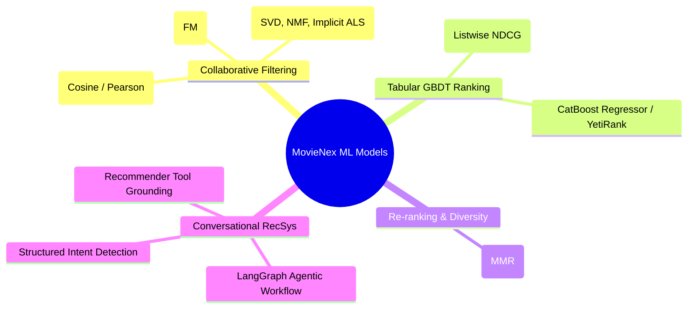
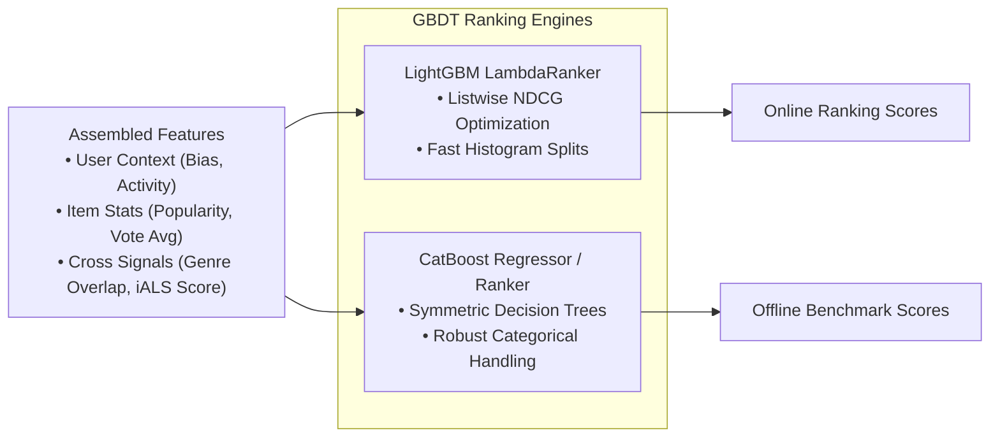
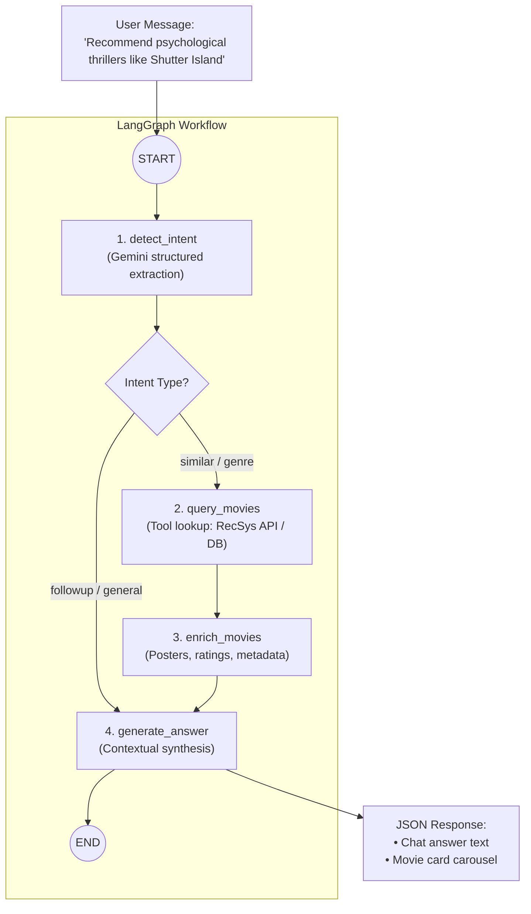

# Applied Machine Learning & Conversational Recommendation

This document covers the machine learning algorithms, mathematical formulations, and conversational agent architecture implemented in **MovieNex**. The stack combines collaborative filtering, tabular Gradient Boosted Decision Trees (**LightGBM** and **CatBoost**), diversity optimization (**MMR**), and agentic workflows (**LangGraph + Gemini**).

---

## 1. Algorithmic Overview

---

## 2. Mathematical Formulations

### 2.1. Collaborative Filtering & Latent Factor Models

| Model | Formulation | Practical Use Case |
| :--- | :--- | :--- |
| **Pearson User-Based CF** | $\text{Sim}(u, v) = \frac{\sum_{i \in I_{uv}} (r_{ui} - \bar{r}_u)(r_{vi} - \bar{r}_v)}{\sqrt{\sum (r_{ui} - \bar{r}_u)^2} \sqrt{\sum (r_{vi} - \bar{r}_v)^2}}$ | Normalizes for user rating biases (e.g., users who systematically rate higher). |
| **Explicit SVD with Biases** | $\hat{r}_{ui} = \mu + b_u + b_i + \mathbf{p}_u^T \mathbf{q}_i$ | Baseline matrix factorization on explicit 1-5 star ratings. |
| **Implicit ALS (iALS)** | $\mathcal{L} = \sum_{u, i} c_{ui} (p_{ui} - \mathbf{x}_u^T \mathbf{y}_i)^2 + \lambda (\|\mathbf{x}_u\|_2^2 + \|\mathbf{y}_i\|_2^2)$ | Candidate generation from binary interactions ($p_{ui} \in \{0, 1\}$) with confidence $c_{ui} = 1 + \alpha r_{ui}$. |

---

### 2.2. Factorization Machines (FM)

Factorization Machines model all pairwise second-order feature interactions in linear time $\mathcal{O}(k \cdot d)$:

$$\hat{y}(\mathbf{x}) = w_0 + \sum_{j=1}^d w_j x_j + \frac{1}{2} \sum_{f=1}^k \left[ \left( \sum_{j=1}^d v_{j, f} x_j \right)^2 - \sum_{j=1}^d v_{j, f}^2 x_j^2 \right]$$

This allows learning interactions even in sparse matrices where specific feature pairs rarely co-occur in the training data.

---

### 2.3. Gradient Boosted Decision Tree Ranking

#### LightGBM LambdaRank Gradient
LightGBM optimizes listwise ranking by scaling pairwise classification errors with the change in NDCG resulting from swapping candidate positions:

$$\lambda_{ij} = \frac{-\sigma}{1 + e^{\sigma(s_i - s_j)}} |\Delta \text{NDCG}_{ij}|$$

#### Model Comparison

| Evaluation Dimension | LightGBM (`LGBMRanker`) | CatBoost (`CatBoostRegressor`) |
| :--- | :--- | :--- |
| **Primary Objective** | Listwise NDCG optimization | Pointwise RMSE regression / Pairwise |
| **Categorical Handling** | Integer index with histogram binning | Native target-based ordered statistics |
| **Training Speed** | Fast histogram split finding | Moderate (symmetric tree building) |
| **Inference Latency** | $< 10\,\text{ms}$ | $\approx 20\,\text{ms}$ |
| **Production Role** | **Online Stage 2 Ranker** in FastAPI | **Offline benchmark & alternative** |

---

### 2.4. Diversity Re-ranking via MMR

Maximal Marginal Relevance balances relevance scores against genre redundancy:

$$\text{MMR} = \arg\max_{i \in \text{Candidates} \setminus S} \left[ \lambda \cdot \text{Score}(u, i) - (1 - \lambda) \max_{j \in S} \text{Sim}_{\text{Genre}}(i, j) \right]$$

Setting $\lambda = 0.7$ gives high relevance while improving genre diversity across the top-10 recommendation slate.

---

## 3. Conversational Recommender System (CRS)

Traditional recommenders rely on passive interaction logs. The conversational assistant provides an interactive chat channel using multi-turn dialogue with LangGraph and the Gemini API.

### Graph Workflow Components

| Node Name | Function | Implementation Details |
| :--- | :--- | :--- |
| `detect_intent` | Intent classification | Uses Gemini with Pydantic schema to extract intent (`similar`, `genre`, `followup`), target movie title, and genre tags. |
| `query_movies` | Recommender grounding | Calls `RecsysService.get_similar_movies()` or queries the movie catalog database for matches. |
| `enrich_movies` | Metadata hydration | Adds movie posters, release year, and review ratings from the catalog. |
| `generate_answer` | Response synthesis | Generates an informative, conversational response explaining why the titles were selected. |
