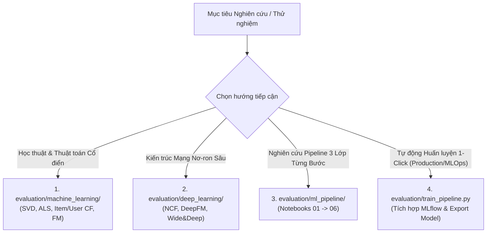

# 🔬 Bộ Thử nghiệm & Đánh giá Mô hình Gợi ý (RecSys Evaluation & Benchmarks)

Thư mục `evaluation/` là trung tâm nghiên cứu, phát triển thuật toán và kiểm thử hiệu năng của hệ thống gợi ý phim **MovieNex**. Nơi đây cung cấp quy trình hoàn chỉnh từ phân tích khám phá dữ liệu (EDA), đối sánh các mô hình Học máy truyền thống & Học sâu, phát triển Pipeline 3 Lớp công nghiệp, đến tự động hóa huấn luyện liên tục (Continuous Training) tích hợp **MLflow**.

---

## 🗂️ Cấu trúc Thư mục

```
evaluation/
├── eda/                               # Exploratory Data Analysis
│   └── eda.ipynb                      # Khám phá phân phối ratings, thể loại, hành vi người dùng
├── machine_learning/                  # Thuật toán ML truyền thống
│   ├── README.md                      # Cơ sở toán học CF, SVD, ALS, FM & hướng dẫn chạy
│   ├── generate_notebook.py           # Script tự động tạo notebook kiểm thử ML
│   └── ml_evaluation.ipynb            # Notebook so sánh SVD, ALS, NMF, Item/User CF
├── deep_learning/                     # Thuật toán Học sâu (Deep Learning)
│   ├── README.md                      # Cơ sở toán học NeuMF, AutoRec, Wide & Deep, SASRec
│   ├── generate_dl_notebook.py        # Script tự động tạo notebook kiểm thử DL
│   ├── dl_evaluation.ipynb            # Notebook so sánh NeuMF, DeepFM, Wide&Deep
│   ├── best_neumf_weights.weights.h5  # Trọng số tối ưu đã huấn luyện của Neural CF
│   ├── best_dfm_weights.weights.h5    # Trọng số tối ưu đã huấn luyện của DeepFM
│   └── best_wd_weights.weights.h5     # Trọng số tối ưu đã huấn luyện của Wide & Deep
├── ml_pipeline/                       # Pipeline Gợi ý 3 Lớp Chuẩn Công Nghiệp
│   ├── README.md                      # Tài liệu chi tiết 3-Stage Pipeline (Retrieval, Ranking, Re-ranking)
│   ├── generate_pipeline_notebooks.py # Tự động tạo 6 notebooks pipeline tuần tự
│   ├── 01_data_preparation.ipynb     # Chuẩn bị dữ liệu & chia Time-based Leave-One-Out
│   ├── 02_content_based_retrieval.ipynb # Stage 1A: TF-IDF Content-Based Retrieval
│   ├── 03_collaborative_filtering.ipynb # Stage 1B: Implicit ALS Candidate Retrieval
│   ├── 04_lightgbm_ranker.ipynb       # Stage 2: LightGBM LambdaRank Scoring & Ranking
│   ├── 05_mmr_reranking.ipynb         # Stage 3: MMR Diversity Re-ranking
│   ├── 06_end_to_end_pipeline.ipynb   # Chuỗi End-to-End & Báo cáo Metrics tổng hợp
│   └── models/                        # Model artifacts lưu cục bộ (lgb_ranker.pkl)
├── ml_training/                       # Tinh chỉnh Siêu tham số & Đóng gói Model
│   ├── README.md                      # Hướng dẫn chi tiết LightGBM & CatBoost với Optuna
│   ├── configs.yaml                   # File cấu hình siêu tham số
│   ├── requirements.txt               # Thư viện phục vụ huấn luyện
│   ├── src/                           # Mã nguồn huấn luyện, feature engineering, Optuna tuning
│   ├── models.joblib                  # Model artifacts đã đóng gói
│   └── ranking_comparison_results.png # Biểu đồ so sánh Precision/Recall/NDCG
├── train_pipeline.py                  # 🚀 Script 1-Click Continuous Training (Tích hợp MLflow)
├── recsys_utils.py                    # Thư viện tiện ích & metrics đánh giá dùng chung
└── tests/                             # Unit tests cho các module evaluation
```

---

## 🧭 Lựa chọn Tiếp cận & Hướng dẫn Thực thi

Hệ thống cung cấp 4 lộ trình thử nghiệm tùy theo mục tiêu của bạn:



---

### 1. Thử nghiệm Machine Learning Truyền thống (`evaluation/machine_learning/`)

Tập trung vào các thuật toán Phân rã ma trận (Matrix Factorization) và Lọc cộng tác:

```bash
# Tạo notebook nếu chưa có
python evaluation/machine_learning/generate_notebook.py

# Mở Jupyter để chạy thực nghiệm
jupyter notebook evaluation/machine_learning/ml_evaluation.ipynb
```
*Chi tiết: Xem thêm tại [`evaluation/machine_learning/README.md`](./machine_learning/README.md).*

---

### 2. Thử nghiệm Deep Learning (`evaluation/deep_learning/`)

Tập trung vào các mạng nơ-ron biểu diễn tương tác phi tuyến và kết hợp embeddings:

```bash
# Tạo notebook nếu chưa có
python evaluation/deep_learning/generate_dl_notebook.py

# Mở Jupyter để chạy thực nghiệm
jupyter notebook evaluation/deep_learning/dl_evaluation.ipynb
```
*Chi tiết: Xem thêm tại [`evaluation/deep_learning/README.md`](./deep_learning/README.md).*

---

### 3. Khám phá 3-Stage ML Pipeline (`evaluation/ml_pipeline/`)

Thực hiện tuần tự 6 notebooks đại diện cho kiến trúc gợi ý chuẩn công nghiệp:

```bash
# Tạo/cập nhật bộ 6 notebooks
python evaluation/ml_pipeline/generate_pipeline_notebooks.py
```
Sau đó mở và chạy tuần tự từ `01_data_preparation.ipynb` đến `06_end_to_end_pipeline.ipynb`.  
*Chi tiết: Xem thêm tại [`evaluation/ml_pipeline/README.md`](./ml_pipeline/README.md).*

---

### 4. Huấn luyện Tự động 1-Click với MLflow (`evaluation/train_pipeline.py`)

Đây là script tự động hóa toàn bộ quy trình:
1. Đọc dữ liệu từ `data/crawler/movies_crawled.csv` và `data/simulator/sim_ratings.csv`.
2. Phân chia tập huấn luyện theo **Time-based Leave-One-Out (LOO)**.
3. Huấn luyện mô hình Lọc nội dung TF-IDF và Lọc cộng tác Implicit ALS.
4. Trích xuất 8 đặc trưng kết hợp và huấn luyện **LightGBM LambdaRanker**.
5. Đánh giá xếp hạng trên tập test với Negative Sampling (1 test movie + 99 random items).
6. Tính toán các metrics ($HR@10$, $NDCG@10$, $MRR$).
7. Kiểm tra Quality Gate ($NDCG@10 \ge 0.15$).
8. Ghi lại các thông số và metrics lên **MLflow Tracking Server** (http://localhost:5000).
9. Lưu mô hình vào `evaluation/ml_pipeline/models/lgb_ranker.pkl` để backend WebApp sử dụng.

#### Cách chạy:
```bash
# 1. Đảm bảo MLflow server đang chạy (trong docker-compose)
docker compose up -d mlflow postgres seaweedfs

# 2. Thực thi script huấn luyện
python evaluation/train_pipeline.py
```

---

## 📊 Hệ thống Chỉ số Đánh giá (`recsys_utils.py`)

Hệ thống chuẩn hóa toàn bộ hàm tính toán metrics trong [`recsys_utils.py`](./recsys_utils.py):

| Chỉ số | Tên đầy đủ | Ý nghĩa |
| :--- | :--- | :--- |
| **HR@K** | Hit Ratio @ K | Tỷ lệ user có ít nhất một phim đúng nằm trong danh sách Top-K |
| **NDCG@K** | Normalized Discounted Cumulative Gain @ K | Đo lường độ chính xác có tính đến vị trí xếp hạng của phim đúng |
| **MRR** | Mean Reciprocal Rank | Nghịch đảo vị trí xuất hiện của phim đúng đầu tiên |
| **Precision@K** | Precision @ K | Tỷ lệ phim được gợi ý thực sự có liên quan |
| **Recall@K** | Recall @ K | Tỷ lệ phim liên quan được hệ thống tìm thấy |
| **Diversity@K** | Catalog Diversity @ K | Đo lường khoảng cách cosine giữa các phim trong Top-K dựa trên thể loại |
| **Novelty@K** | Item Novelty @ K | Đo lường mức độ độc lạ / ít phổ biến của các gợi ý (khám phá long-tail) |
| **Coverage@K** | Catalog Coverage @ K | Tỷ lệ phim trong catalog được đề xuất ít nhất một lần cho toàn bộ user |
