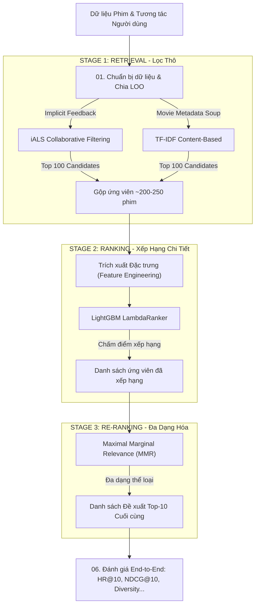

# 🎬 Pipeline Gợi ý Phim 3 Lớp (3-Stage Movie Recommendation Pipeline)

Tài liệu này cung cấp cái nhìn chi tiết và toàn diện về **Pipeline Học Máy (ML Pipeline)** chuẩn công nghiệp hiện đại của hệ thống gợi ý phim **MovieNex** (tương tự như kiến trúc của Netflix, YouTube, TikTok), kết hợp hài hòa giữa tốc độ xử lý nhanh ở tầng lọc thô và độ chính xác, tính cá nhân hóa cao ở tầng xếp hạng chi tiết.

---

## 📌 Kiến trúc Tổng quan (System Architecture)

Hệ thống sử dụng kiến trúc **3-Stage Recommendation Engine**:



---

## 📂 Cấu trúc Thư mục & Tài liệu Chi tiết

Toàn bộ mã nguồn của pipeline được tổ chức dưới dạng các Jupyter Notebook liên kết chặt chẽ với nhau trong thư mục `evaluation/ml_pipeline/`:

| Tên Tệp tin | Vai trò trong Pipeline | Mô tả công việc chính |
| :--- | :--- | :--- |
| 📄 [01_data_preparation.ipynb](./01_data_preparation.ipynb) | **Data Preparation** | Tải dữ liệu thô, phân chia tập huấn luyện/kiểm thử theo thời gian (**Time-Based Leave-One-Out**). |
| 📄 [02_content_based_retrieval.ipynb](./02_content_based_retrieval.ipynb) | **Stage 1A: Retrieval** | Xây dựng bộ lọc thô dựa trên thuộc tính nội dung phim (Content-Based) bằng TF-IDF. |
| 📄 [03_collaborative_filtering.ipynb](./03_collaborative_filtering.ipynb) | **Stage 1B: Retrieval** | Xây dựng bộ lọc thô dựa trên hành vi tương tác cộng tác (Collaborative) bằng Implicit ALS. |
| 📄 [04_lightgbm_ranker.ipynb](./04_lightgbm_ranker.ipynb) | **Stage 2: Ranking** | Trích xuất các đặc trưng tĩnh/động và huấn luyện mô hình xếp hạng **LightGBM LambdaRank**. |
| 📄 [05_mmr_reranking.ipynb](./05_mmr_reranking.ipynb) | **Stage 3: Re-ranking** | Đa dạng hóa danh sách đề xuất bằng giải thuật **Maximal Marginal Relevance (MMR)**. |
| 📄 [06_end_to_end_pipeline.ipynb](./06_end_to_end_pipeline.ipynb) | **End-to-End & Evaluation** | Kết chuỗi toàn bộ pipeline và đánh giá hiệu năng bằng các metrics chuẩn xác và ngoài chính xác. |
| 🛠️ [generate_pipeline_notebooks.py](./generate_pipeline_notebooks.py) | **Generator Script** | File Python tự động khởi tạo hoặc làm mới 6 notebook trên dựa vào template code chuẩn. |
| 📦 `models/lgb_ranker.pkl` | **Trained Artifact** | File model đã được huấn luyện, dùng cho WebApp Backend serving. |

---

## 🛠️ Chi tiết các Bước thực hiện (Step-by-Step Breakdown)

### 1. Chuẩn bị Dữ liệu (Data Preparation)
* **Phương pháp chia dữ liệu**: Sử dụng **Time-Based Leave-One-Out (LOO)** để chia tập Train/Test. Tương tác cuối cùng theo thời gian (`timestamp`) của mỗi người dùng sẽ được giữ lại làm tập Test, toàn bộ tương tác trước đó được dùng làm tập Train.
* **Mẫu thử nghiệm âm (Negative Sampling)**: Đối với mỗi người dùng ở tập Test, hệ thống chọn ngẫu nhiên **99 bộ phim mà người dùng chưa từng tương tác** trộn lẫn với 1 bộ phim dương thực tế (Ground Truth) để tạo tập đánh giá gồm 100 ứng viên.
* > [!IMPORTANT]
  > **Quyết định thiết kế**: Chia tập dữ liệu ngẫu nhiên (Random Split) thông thường sẽ gây ra lỗi **Rò rỉ dữ liệu (Data Leakage)** nghiêm trọng trong hệ thống gợi ý, do lấy dữ liệu ở tương lai để dự đoán quá khứ. Chia theo thời gian (LOO) phản ánh chính xác nhất cách hệ thống vận hành thực tế.

---

### 2. Stage 1: Retrieval (Tầng Lọc Thô / Lấy Ứng Viên)
Nhằm mục đích rút gọn kho phim lớn (hàng ngàn phim) xuống còn vài trăm ứng viên tiềm năng cao cho mỗi người dùng chỉ trong vài mili-giây. Tầng này kết hợp hai hướng tiếp cận bổ trợ nhau:

#### A. Content-Based Retrieval (Lọc dựa trên Nội dung)
* **Thuật toán**: Tạo một chuỗi thông tin tổng hợp (`soup`) gồm: `genres` (thể loại), `director` (đạo diễn), `cast` (diễn viên chính), và `keywords` (từ khóa). Sau đó áp dụng **TF-IDF Vectorizer** kết hợp **Cosine Similarity** để tìm các phim có nội dung tương đồng nhất với lịch sử xem của user.
* > [!TIP]
  > **Tại sao TF-IDF?** Với các thuộc tính dạng từ khóa hoặc tên riêng ngắn gọn, SBERT không mang lại lợi ích vượt trội về mặt ngữ nghĩa mà lại gây ra Overhead tính toán lớn. TF-IDF là giải pháp nhanh, gọn và hiệu quả tuyệt đối cho bài toán so khớp thuộc tính tĩnh.

#### B. Collaborative Filtering (Lọc Cộng Tác Ngầm Định)
* **Thuật toán**: Áp dụng thuật toán **Implicit Alternating Least Squares (iALS)**.
* **Thiết lập trọng số phễu tương tác (Behavior Funnel Weighting)**: Chuyển đổi dữ liệu implicit feedback thành ma trận độ tin cậy (confidence matrix) theo trọng số tăng dần của hành vi:
  $$\text{Click (1.0)} \rightarrow \text{Detail View (2.0)} \rightarrow \text{Watch Start (3.0)} \rightarrow \text{Watch Complete (5.0)}$$

* **Kết quả**: Hợp (Union) danh sách Top-100 phim từ mỗi bộ lọc để tạo ra tập ứng viên thô chứa khoảng **200 - 250 bộ phim**.

---

### 3. Stage 2: Ranking (Xếp hạng Chi tiết)
Sau khi lọc thô, tầng này sử dụng một mô hình máy học mạnh mẽ để chấm điểm chính xác mức độ yêu thích của người dùng cho từng bộ phim trong danh sách ứng viên.

* **Thuật toán**: **LightGBM LambdaRank** (`LGBMRanker`).
* **Hàm mục tiêu tối ưu**: Tối ưu trực tiếp chỉ số xếp hạng **NDCG** (Normalized Discounted Cumulative Gain), đưa các phim có khả năng click cao lên đầu.
* **Kỹ thuật Đặc trưng (Feature Engineering)**: Hệ thống xây dựng 8 đặc trưng giá trị bao gồm:
  1. *Đặc trưng Vật phẩm (Item)*: `popularity`, `vote_average`, `release_year`.
  2. *Đặc trưng Người dùng (User)*: `user_activity`, `user_bias`.
  3. *Đặc trưng Giao cắt (Cross/Interaction)*: `genre_overlap` (số thể loại trùng khớp giữa phim và danh sách thể loại yêu thích của user).
  4. *Đặc trưng Điểm số Lọc thô (Retrieval Scores)*: `als_score` (từ mô hình iALS) và `cb_score` (điểm tương đồng nội dung từ TF-IDF).

---

### 4. Stage 3: Re-ranking (Đa dạng hóa danh sách đề xuất)
Nếu chỉ dựa vào điểm số của Ranker, danh sách đề xuất rất dễ rơi vào tình trạng đơn điệu. Tầng này cân bằng giữa độ chính xác và độ phủ thể loại.

* **Thuật toán**: **Maximal Marginal Relevance (MMR)**.
* **Cơ chế hoạt động**: Lựa chọn tuần tự từng bộ phim vào danh sách đề xuất cuối cùng:
  $$MMR = \arg\max_{i \in \text{Candidates}} \left[ \lambda \cdot \text{Score}_{\text{Ranker}}(i) - (1 - \lambda) \cdot \max_{j \in \text{Selected}} \text{Similarity}_{\text{Genre}}(i, j) \right]$$
* **Hệ số cân bằng**: Mặc định $\lambda = 0.7$ (70% ưu tiên độ chính xác, 30% ưu tiên đa dạng hóa thể loại).

---

## 📈 Bộ Chỉ số Đánh giá (Evaluation Metrics)

* **Hit Ratio@10 (HR@10)**: Tỷ lệ phim thực tế người dùng đã xem xuất hiện trong Top-10 đề xuất.
* **NDCG@10**: Đánh giá chất lượng xếp hạng có tính đến vị trí của phim trong danh sách.
* **MRR (Mean Reciprocal Rank)**: Nghịch đảo vị trí xuất hiện của phim đúng đầu tiên.
* **Diversity@10 (Độ đa dạng)**: Khoảng cách cosine trung bình giữa các phim trong Top-10 dựa trên thể loại ($1 - \text{CosineSimilarity}$).
* **Novelty@10 (Độ mới lạ)**: Đo lường mức độ bất ngờ của gợi ý (long-tail discovery).
* **Coverage@10 (Độ phủ)**: Tỷ lệ phần trăm số phim trong catalog được hệ thống gợi ý ít nhất một lần cho toàn bộ người dùng.

---

## 🚀 Hướng dẫn Chạy Thử nghiệm ML Pipeline

### Cách 1: Chạy Tuần tự Từng Bước bằng Notebook

Chạy các lệnh từ **thư mục gốc dự án** (`movie-recsys/`):

```bash
# 1. Khởi tạo / cập nhật các notebook
python evaluation/ml_pipeline/generate_pipeline_notebooks.py

# 2. Sinh dữ liệu giả lập nếu chưa có
python data/simulator/generate_data.py --movies_csv data/crawler/movies_crawled.csv --num_users 200 --output_dir data/simulator

# 3. Mở Jupyter Notebook và chạy tuần tự từ 01 đến 06
jupyter notebook evaluation/ml_pipeline/01_data_preparation.ipynb
```

Thực thi tuần tự:
- `01_data_preparation.ipynb` -> Chia tập train/test theo LOO.
- `02_content_based_retrieval.ipynb` -> TF-IDF matrix cho phim.
- `03_collaborative_filtering.ipynb` -> Huấn luyện Implicit ALS.
- `04_lightgbm_ranker.ipynb` -> Trích xuất đặc trưng & huấn luyện LightGBM Ranker.
- `05_mmr_reranking.ipynb` -> Kiểm thử giải thuật MMR.
- `06_end_to_end_pipeline.ipynb` -> Chạy chuỗi hoàn chỉnh & xuất báo cáo metrics.

---

### Cách 2: Chạy Tự động 1-Click (Khuyên Dùng cho Production)

Nếu bạn muốn chạy toàn bộ quy trình huấn luyện, đánh giá và xuất model tự động lên MLflow Tracking chỉ với 1 lệnh:

```bash
python evaluation/train_pipeline.py
```
Script sẽ tự động lưu model vào `evaluation/ml_pipeline/models/lgb_ranker.pkl` để FastAPI Backend nạp vào phục vụ người dùng.
