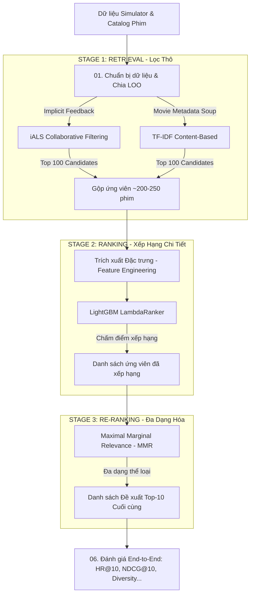

# 🎬 Pipeline Gợi ý Phim 3 Lớp (3-Stage Movie Recommendation Pipeline)

Tài liệu này cung cấp cái nhìn chi tiết và toàn diện về **Pipeline Học Máy (ML Pipeline)** hiện tại được áp dụng trong dự án Movie Recommendation System. Pipeline này được thiết kế theo mô hình chuẩn công nghiệp hiện đại của các hệ thống gợi ý quy mô lớn (như Netflix, YouTube, TikTok), kết hợp hài hòa giữa tốc độ xử lý nhanh ở tầng lọc thô và độ chính xác, tính cá nhân hóa cao ở tầng xếp hạng chi tiết.

---

## 📌 Kiến trúc Tổng quan (System Architecture)

Hệ thống sử dụng kiến trúc **3-Stage Recommendation Engine**:



---

## 📂 Cấu trúc Thư mục & Tài liệu chi tiết

Toàn bộ mã nguồn của pipeline được tổ chức dưới dạng các Jupyter Notebook liên kết chặt chẽ với nhau nằm trong thư mục [evaluation/ml_pipeline](./):

| Tên Tệp tin | Vai trò trong Pipeline | Mô tả công việc chính |
| :--- | :--- | :--- |
| 📄 [01_data_preparation.ipynb](./01_data_preparation.ipynb) | **Data Preparation** | Tải dữ liệu thô, phân chia tập huấn luyện/kiểm thử theo thời gian (Time-Based Leave-One-Out). |
| 📄 [02_content_based_retrieval.ipynb](./02_content_based_retrieval.ipynb) | **Stage 1A: Retrieval** | Xây dựng bộ lọc thô dựa trên thuộc tính nội dung phim (Content-Based) bằng TF-IDF. |
| 📄 [03_collaborative_filtering.ipynb](./03_collaborative_filtering.ipynb) | **Stage 1B: Retrieval** | Xây dựng bộ lọc thô dựa trên hành vi tương tác cộng tác (Collaborative) bằng Implicit ALS. |
| 📄 [04_lightgbm_ranker.ipynb](./04_lightgbm_ranker.ipynb) | **Stage 2: Ranking** | Trích xuất các đặc trưng tĩnh/động và huấn luyện mô hình xếp hạng LightGBM LambdaRank. |
| 📄 [05_mmr_reranking.ipynb](./05_mmr_reranking.ipynb) | **Stage 3: Re-ranking** | Đa dạng hóa danh sách đề xuất bằng giải thuật Maximal Marginal Relevance (MMR). |
| 📄 [06_end_to_end_pipeline.ipynb](./06_end_to_end_pipeline.ipynb) | **End-to-End & Evaluation** | Kết chuỗi toàn bộ pipeline và đánh giá hiệu năng bằng các metrics chuẩn xác và ngoài chính xác. |
| 🛠️ [generate_pipeline_notebooks.py](./generate_pipeline_notebooks.py) | **Generator Script** | File Python tự động khởi tạo hoặc làm mới 6 notebook trên dựa vào các template code chuẩn. |

---

## 🛠️ Chi tiết các Bước thực hiện (Step-by-Step Breakdown)

### 1. Chuẩn bị Dữ liệu (Data Preparation)
* **Phương pháp chia dữ liệu**: Sử dụng **Time-Based Leave-One-Out (LOO)** để chia tập Train/Test. Tương tác cuối cùng theo thời gian (`timestamp`) của mỗi người dùng sẽ được giữ lại làm tập Test, toàn bộ tương tác trước đó được dùng làm tập Train.
* **Mẫu thử nghiệm âm (Negative Sampling)**: Đối với mỗi người dùng ở tập Test, hệ thống chọn ngẫu nhiên **99 bộ phim mà người dùng chưa từng tương tác** trộn lẫn với 1 bộ phim dương thực tế (Ground Truth) để tạo tập đánh giá gồm 100 ứng viên.
* > [!IMPORTANT]
  > **Quyết định thiết kế**: Chia tập dữ liệu ngẫu nhiên (Random Split) hoặc K-Fold Cross Validation thông thường sẽ gây ra lỗi **Rò rỉ dữ liệu (Data Leakage)** nghiêm trọng trong hệ thống gợi ý, do lấy dữ liệu ở tương lai để dự đoán quá khứ. Chia theo thời gian (LOO) phản ánh chính xác nhất cách hệ thống vận hành thực tế.

---

### 2. Stage 1: Retrieval (Tầng Lọc Thô/Lấy Ứng Viên)
Nhằm mục đích rút gọn kho phim lớn (hàng ngàn phim) xuống còn vài trăm ứng viên tiềm năng cao cho mỗi người dùng chỉ trong vài mili-giây. Tầng này kết hợp hai hướng tiếp cận bổ trợ nhau:

#### A. Content-Based Retrieval (Lọc dựa trên Nội dung)
* **Thuật toán**: Tạo một chuỗi thông tin tổng hợp (`soup`) gồm: `genres` (thể loại), `director` (đạo diễn), `cast` (diễn viên chính), và `keywords` (từ khóa). Sau đó áp dụng **TF-IDF Vectorizer** (trích xuất đặc trưng dạng từ khóa đơn và cụm từ - unigram & bigram) kết hợp **Cosine Similarity** để tìm các phim có nội dung tương đồng nhất với lịch sử xem của user.
* > [!TIP]
  > **Tại sao không dùng Deep Learning (SBERT)?** Với các thuộc tính dạng từ khóa hoặc tên riêng ngắn gọn, SBERT không mang lại lợi ích vượt trội về mặt ngữ nghĩa mà lại gây ra Overhead tính toán cực lớn (suy luận chậm trên CPU, kích thước model lớn). TF-IDF là giải pháp nhanh, gọn và hiệu quả tuyệt đối cho bài toán so khớp thuộc tính tĩnh.

#### B. Collaborative Filtering (Lọc Cộng Tác Ngầm Định)
* **Thuật toán**: Áp dụng thuật toán **Implicit Alternating Least Squares (iALS)**.
* **Thiết lập trọng số phễu tương tác (Behavior Funnel Weighting)**: Chuyển đổi dữ liệu implicit feedback (tập tin log click) thành ma trận độ tin cậy (confidence matrix) theo trọng số tăng dần của hành vi:
  $$\text{Click (1.0)} \rightarrow \text{Detail View (2.0)} \rightarrow \text{Watch Start (3.0)} \rightarrow \text{Watch Complete (5.0)}$$
* > [!NOTE]
  > **Tại sao chọn iALS thay vì SVD truyền thống?** Trong thế giới thực, dữ liệu chủ yếu là phản hồi ngầm định (không chấm sao). SVD truyền thống coi các ô trống là nhãn âm (ghét), trong khi thực tế có thể user chưa biết đến phim đó. iALS xử lý triệt để bằng cách xem tất cả phần tử là thước đo độ tin cậy kết hợp với nhân tử ẩn để mô hình hóa sở thích.

* **Kết quả**: Hợp (Union) danh sách Top-100 phim từ mỗi bộ lọc để tạo ra tập ứng viên thô chứa khoảng **200 - 250 bộ phim**.

---

### 3. Stage 2: Ranking (Xếp hạng Chi tiết)
Sau khi lọc thô, tầng này sử dụng một mô hình máy học mạnh mẽ để chấm điểm chính xác mức độ yêu thích của người dùng cho từng bộ phim trong danh sách ứng viên.

* **Thuật toán**: **LightGBM LambdaRank** (`LGBMRanker`).
* **Hàm mục tiêu tối ưu**: Tối ưu trực tiếp chỉ số xếp hạng **NDCG** (Normalized Discounted Cumulative Gain), đưa các phim có khả năng click cao lên đầu thay vì tối ưu sai số MSE hay phân lớp nhị phân thông thường.
* **Kỹ thuật Đặc trưng (Feature Engineering)**: Hệ thống xây dựng 8 đặc trưng giá trị bao gồm:
  1. *Đặc trưng Vật phẩm (Item)*: `popularity` (độ phổ biến), `vote_average` (điểm trung bình), `release_year` (năm phát hành).
  2. *Đặc trưng Người dùng (User)*: `user_activity` (tần suất hoạt động), `user_bias` (thiên vị chấm điểm của user).
  3. *Đặc trưng Giao cắt (Cross/Interaction)*: `genre_overlap` (số thể loại trùng khớp giữa phim và danh sách thể loại yêu thích của người dùng).
  4. *Đặc trưng Điểm số Lọc thô (Retrieval Scores)*: `als_score` (từ mô hình iALS) và `cb_score` (điểm tương tương nội dung từ TF-IDF).
* > [!TIP]
  > **Tại sao chọn LightGBM thay vì Deep Learning (NeuMF/DeepFM) hay Logistic Regression?** 
  > * So với Logistic Regression: LightGBM (dạng cây quyết định tăng cường - GBDT) tự động phát hiện các mối quan hệ phi tuyến và đặc trưng chéo phức tạp mà không cần thiết kế thủ công.
  > * So với Deep Learning: Tập dữ liệu nhỏ dễ gây quá khớp (overfitting) với mạng neural sâu. LightGBM huấn luyện cực nhanh trên CPU, cần ít dữ liệu hơn mà vẫn đạt hiệu quả tương đương hoặc vượt trội.

---

### 4. Stage 3: Re-ranking (Đa dạng hóa danh sách đề xuất)
Nếu chỉ dựa vào điểm số của Ranker, danh sách đề xuất rất dễ rơi vào tình trạng đơn điệu (ví dụ: gợi ý 10 phim viễn tưởng liên tiếp). Tầng này tối ưu hóa trải nghiệm người dùng bằng cách cân bằng giữa độ chính xác và độ phủ thể loại.

* **Thuật toán**: **Maximal Marginal Relevance (MMR)**.
* **Cơ chế hoạt động**: Lựa chọn tuần tự từng bộ phim vào danh sách đề xuất cuối cùng dựa trên việc tối ưu hóa đồng thời điểm số xếp hạng và giảm thiểu độ tương đồng thể loại với các phim đã được chọn trước đó:
  $$MMR = \arg\max_{i \in \text{Candidates}} \left[ \lambda \cdot \text{Score}_{\text{Ranker}}(i) - (1 - \lambda) \cdot \max_{j \in \text{Selected}} \text{Similarity}_{\text{Genre}}(i, j) \right]$$
* **Điều khiển**: Hệ số $\lambda \in [0, 1]$ dùng để tinh chỉnh: $\lambda \rightarrow 1$ ưu tiên chính xác tuyệt đối; $\lambda \rightarrow 0$ ưu tiên đa dạng hóa tối đa. Hệ thống hiện cấu hình mặc định $\lambda = 0.7$.

---

## 📈 Bộ Chỉ số Đánh giá (Evaluation Metrics)

Hệ thống được đánh giá song song bằng hai nhóm chỉ số chuyên nghiệp để đảm bảo góc nhìn toàn diện:

### A. Chỉ số Độ chính xác (Accuracy Metrics)
* **Hit Ratio@10 (HR@10)**: Tỷ lệ phim thực tế người dùng đã xem xuất hiện trong Top-10 đề xuất (Đo lường khả năng bắt trúng sở thích).
* **NDCG@10 (Normalized Discounted Cumulative Gain)**: Đánh giá chất lượng xếp hạng. Phim thực tế người dùng xem được xếp ở vị trí càng cao thì điểm NDCG càng lớn.
* **MRR (Mean Reciprocal Rank)**: Nghịch đảo vị trí xuất hiện của phim đúng đầu tiên.

### B. Chỉ số Ngoài chính xác (Beyond-Accuracy Metrics)
* **Diversity@10 (Độ đa dạng)**: Khoảng cách cosine trung bình giữa các phim trong Top-10 dựa trên đặc trưng thể loại ($1 - \text{CosineSimilarity}$). Chỉ số càng cao nghĩa là danh sách gợi ý càng phong phú.
* **Novelty@10 (Độ mới lạ)**: Đo lường mức độ bất ngờ của gợi ý bằng lượng thông tin tự thân (Self-Information) dựa trên tần suất tương tác ở tập Train. Gợi ý các bộ phim hay nhưng ít người biết (long-tail items) sẽ tăng điểm Novelty.
* **Coverage@10 (Độ phủ)**: Tỷ lệ phần trăm số phim trong catalog được hệ thống gợi ý ít nhất một lần cho toàn bộ người dùng trong tập test. Tránh tình trạng hệ thống chỉ gợi ý lặp đi lặp lại một số phim hot.

---

## 🚀 Hướng dẫn Chạy Thử nghiệm ML Pipeline

### Bước 1: Khởi tạo/Cập nhật các Notebook
Tại thư mục gốc của dự án, chạy lệnh Python sau để tự động tạo ra 6 notebook tương ứng với các bước trong pipeline:
```powershell
python evaluation/ml_pipeline/generate_pipeline_notebooks.py
```

### Bước 2: Chuẩn bị Dữ liệu Giả lập
Đảm bảo bạn đã chạy bộ simulator để sinh dữ liệu click và rating thô từ TMDB:
```powershell
python simulator/generate_data.py --num_users 200 --output_dir data
```

### Bước 3: Thực thi tuần tự các Notebook
Bạn có thể mở Jupyter Lab / Jupyter Notebook hoặc VS Code để chạy tuần tự từ Notebook `01` đến `06` tại thư mục `evaluation/ml_pipeline/`:
1. Chạy `01_data_preparation.ipynb` để chia tập dữ liệu.
2. Chạy `02_content_based_retrieval.ipynb` để tính TF-IDF Matrix cho phim.
3. Chạy `03_collaborative_filtering.ipynb` để train mô hình Implicit ALS.
4. Chạy `04_lightgbm_ranker.ipynb` để trích xuất feature và train LightGBM Ranker.
5. Chạy `05_mmr_reranking.ipynb` để kiểm tra thuật toán MMR.
6. Chạy `06_end_to_end_pipeline.ipynb` để chạy luồng kết hợp và in báo cáo kết quả đánh giá chi tiết.
