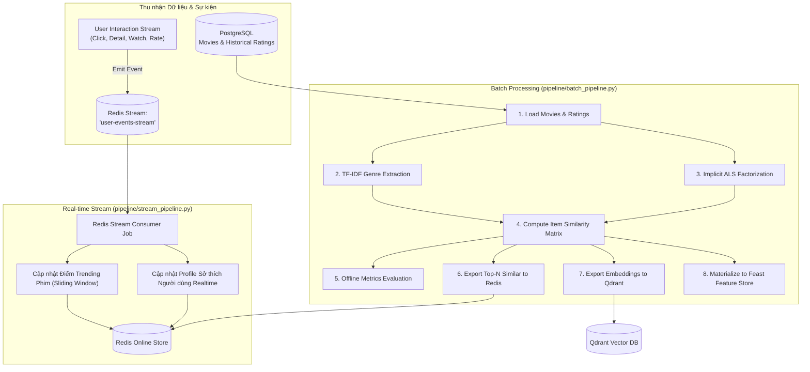

# ⚡ Hệ thống Pipeline Dữ liệu & Đặc trưng (Data & Feature Pipelines)

Thư mục `pipeline/` quản lý toàn bộ các quy trình xử lý dữ liệu hàng loạt (**Batch Pipeline**), xử lý luồng sự kiện thời gian thực (**Streaming Pipeline**), đồng bộ kho đặc trưng (**Feast Feature Store**) và đẩy các mô hình học máy lên kho lưu trữ đối tượng **SeaweedFS S3**.

---

## 🗂️ Cấu trúc Thư mục

```
pipeline/
├── README.md                      # Tài liệu này
├── batch_pipeline.py              # Điểm thực thi chính của Batch Feature Pipeline
├── stream_pipeline.py             # Điểm thực thi chính của Streaming Feature Consumer
├── upload_models_to_seaweedfs.py  # Đồng bộ artifacts mô hình lên SeaweedFS S3
├── feature/
│   ├── config.py                  # Cấu hình kết nối Redis, Qdrant, PostgreSQL
│   ├── db.py                      # Tiện ích truy vấn dữ liệu từ PostgreSQL
│   ├── batch/                     # Các module xử lý hàng loạt
│   │   ├── model.py               # Trích xuất đặc trưng TF-IDF & huấn luyện Implicit ALS
│   │   ├── similarity.py          # Tính toán ma trận độ tương đồng Item-Item Cosine
│   │   ├── metrics.py             # Đo lường các chỉ số offline (HR@10, NDCG@10)
│   │   └── exporter.py            # Xuất kết quả gợi ý vào Redis & Qdrant Vector DB
│   └── streaming/                 # Các module xử lý luồng sự kiện thời gian thực
│       ├── redis_stream_job.py    # Consumer đọc sự kiện từ Redis Stream 'user-events-stream'
│       └── processor.py           # Tính điểm Trending động & cập nhật Online User Profile
└── feature_store/                 # Cấu hình Feast Feature Store
    ├── feature_store.yaml         # Định nghĩa kho đặc trưng Feast (Postgres offline, Redis online)
    └── materialize.py             # Script đồng bộ (materialize) dữ liệu từ Offline sang Online Store
```

---

## 🔄 Kiến trúc Xử lý Đặc trưng (Feature Architecture)



---

## 🚀 Hướng dẫn Thực thi Chi tiết

Chạy các lệnh sau từ **thư mục gốc dự án** (`movie-recsys/`).

### 1. Chạy Batch Feature Pipeline (`batch_pipeline.py`)

Thực hiện trích xuất toàn bộ đặc trưng nội dung (TF-IDF) và lọc cộng tác (Implicit ALS), tính toán độ tương đồng giữa các phim, đánh giá offline metrics, rồi nạp trực tiếp vào **Redis** và **Qdrant**:

```bash
# Đảm bảo PostgreSQL, Redis và Qdrant đang hoạt động
docker compose up -d postgres redis qdrant

# Khởi chạy batch pipeline
python pipeline/batch_pipeline.py
```

**Các tác vụ được hoàn thành tự động:**
* Trích xuất vector TF-IDF cho tất cả thể loại phim.
* Huấn luyện mô hình ma trận độ tin cậy ngầm định Implicit ALS.
* Tính ma trận tương đồng Cosine kết hợp giữa đặc trưng nội dung và nhân tử ẩn.
* Ghi danh sách Top tương đồng vào Redis (`movie:{id}:similar`).
* Đẩy vector embedding phim lên Qdrant Collection (`movie_embeddings`).
* Kích hoạt Feast materialization đồng bộ offline features sang Redis.

---

### 2. Chạy Real-time Streaming Consumer (`stream_pipeline.py`)

Lắng nghe liên tục các sự kiện hành vi người dùng (phát ra từ WebApp backend qua Redis stream `user-events-stream`), tính toán lại điểm Trending trong cửa sổ trượt và cập nhật hồ sơ người dùng thời gian thực:

```bash
python pipeline/stream_pipeline.py
```
*(Để dừng: nhấn `Ctrl + C`)*

---

### 3. Đồng bộ Model Artifacts lên SeaweedFS S3 (`upload_models_to_seaweedfs.py`)

Sau khi huấn luyện mô hình xếp hạng mới (ví dụ `lgb_ranker.pkl`), đẩy file mô hình lên kho lưu trữ đối tượng S3 tương thích SeaweedFS để các dịch vụ backend tự động tải về khi khởi động:

```bash
# Đảm bảo SeaweedFS đang chạy
docker compose up -d seaweedfs seaweedfs-init

# Đẩy mô hình lên bucket recsys-data/models
python pipeline/upload_models_to_seaweedfs.py
```
